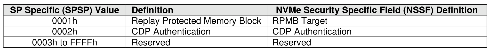

##### 5.2.24.3 Security Protocol EAh

> **Section ID**: 5.2.24.3 | **Page**: 421-421

Security Protocol EAh is assigned for NVMe interface use (refer to ACS-4). This protocol may be used in
Security Receive and Security Send commands. The specific usage type is defined by the Security Protocol
Specific Field defined in Figure 396.

---
### 📊 Tables (1)

#### Table 1: Untitled Table

| | |
|---|---|
| | |

