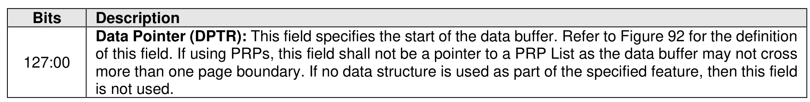
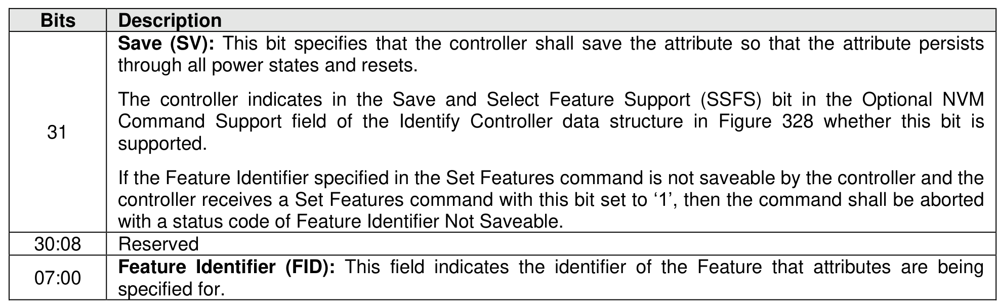
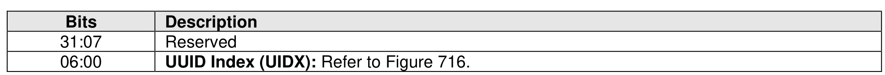
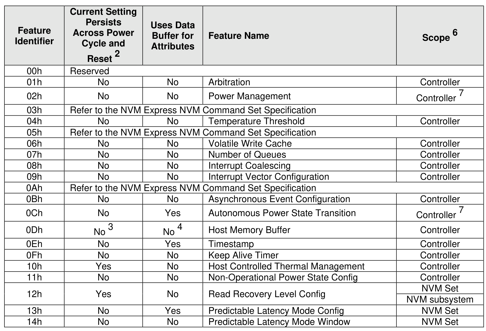
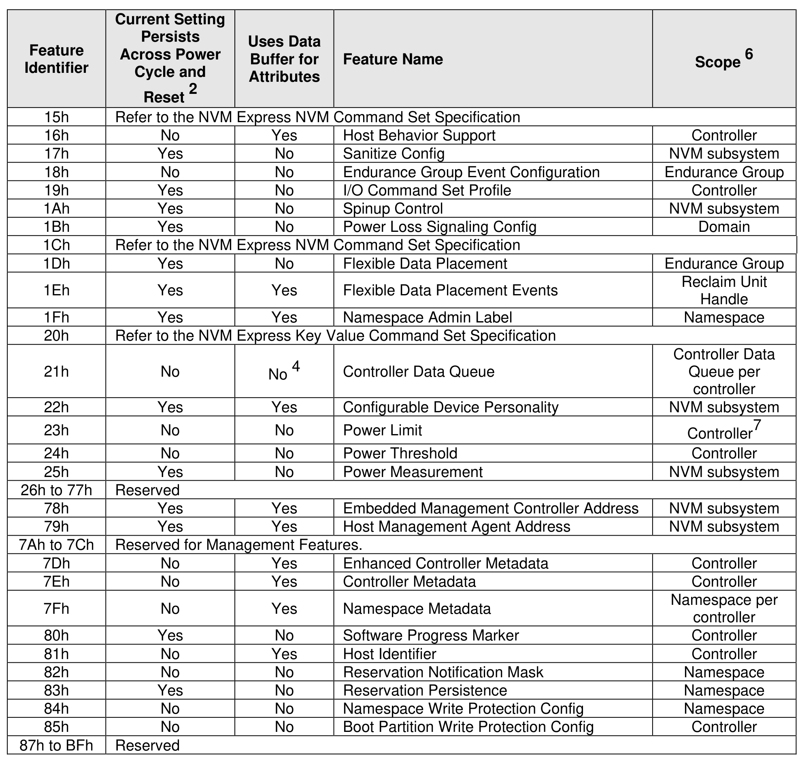
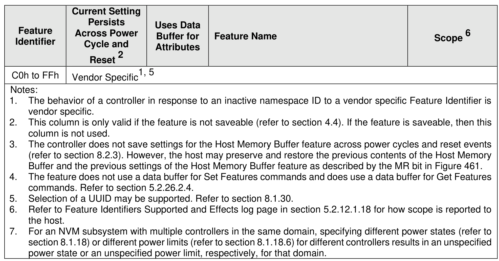

#### 5.2.26 Set Features command

> **Section ID**: 5.2.26 | **Page**: 422-425

The Set Features command specifies the attributes of the Feature indicated.
The Set Features command uses the Data Pointer, Command Dword 10, and Command Dword 14. The
use of Command Dword 11, Command Dword 12, Command Dword 13, and Command Dword 15 fields is
Feature specific. If Command Dword 11, Command Dword 12, Command Dword 13, or Command Dword
15 fields are not used, then the Command Dwords are reserved.
If the controller supports selection of a UUID by the Set Features command (refer to Figure 403 and section
8.1.30) and the controller supports selection of a UUID for:
•
the specified vendor specific feature identifier (refer to Figure 403); or
•
vendor-specific attributes within a Feature (e.g., vendor-specific personalities in the Configurable
Device Personality feature as defined in section 5.2.26.1.24) defined by this specification or any
applicable NVM Express I/O Command Set specification,
then Command Dword 14 is used to specify a UUID Index value (refer to Figure 402).
If the controller does not support selection of a UUID by the Set Features command or the controller does
not support selection of a UUID for:
•
the specified vendor specific feature identifier; or
•
vendor-specific attributes within a Feature defined by this specification or any applicable NVM
Express I/O Command Set specification,
then Command Dword 14 does not specify a UUID Index value.
Figure 403 defines the Features that are able to be configured with a Set Features command and retrieved
with a Get Features command.
Section 5.2.26.1 describes features that are common to all transport models. Section 5.2.26.2 describes
features that are specific to the Memory-based transport model. Section 5.2.26.3 describes features that
are specific to the Message-based transport model.

---
### 📊 Tables (6)

#### Table 1: Untitled Table

| | | | | |
| :--- | :--- | :--- | :--- | :--- |
| | Refer to the NVM Express NVM Command Set Specification | | | |
| | No | No | Temperature Threshold | Controller |
| | Refer to the NVM Express NVM Command Set Specification | | | |
| | No | No | Volatile Write Cache | Controller |
| | No | No | Number of Queues | Controller |
| | No | No | Interrupt Coalescing | Controller |
| | No | No | Interrupt Vector Configuration | Controller |
| | Refer to the NVM Express NVM Command Set Specification | | | |
| | No | No | Asynchronous Event Configuration | Controller |
| | No | Yes | Autonomous Power State Transition | Controller7 |
| | No3 | No4 | Host Memory Buffer | Controller |
| | No | Yes | Timestamp | Controller |
| | No | No | Keep Alive Timer | Controller |
| | Yes | No | Host Controlled Thermal Management | Controller |
| | No | No | Non-Operational Power State Config | Controller |
| | Yes | No | Read Recovery Level Config | NVM Set |
| | | | NVM subsystem | |
| | No | Yes | Predictable Latency Mode Config | NVM Set |
| | No | No | Predictable Latency Mode Window | NVM Set |
| Feature | Persists Across Power Cycle and Reset ² | Uses Data Buffer for Attributes | Feature Name | Scope ⁶ |
| :--- | :--- | :--- | :--- | :--- |
| | | | Refer to the NVM Express NVM Command Set Specification | |
| | No | Yes | Host Behavior Support | Controller |
| | Yes | No | Sanitize Config | NVM subsystem |
| | No | No | Endurance Group Event Configuration | Endurance Group |
| | Yes | No | I/O Command Set Profile | Controller |
| | Yes | No | Spinup Control | NVM subsystem |
| | Yes | No | Power Loss Signaling Config | Domain |
| | | | Refer to the NVM Express NVM Command Set Specification | |
| | Yes | No | Flexible Data Placement | Endurance Group |
| | Yes | Yes | Flexible Data Placement Events | Reclaim Unit Handle |
| | Yes | Yes | Namespace Admin Label | Namespace |
| | | | Refer to the NVM Express Key Value Command Set Specification | |
| | No | No ⁴ | Controller Data Queue | Controller Data Queue per controller |
| | Yes | Yes | Configurable Device Personality | NVM subsystem |
| | No | No | Power Limit | Controller⁷ |
| | No | No | Power Threshold | Controller |
| | Yes | No | Power Measurement | NVM subsystem |
| 77h | Reserved | | | |
| | Yes | Yes | Embedded Management Controller Address | NVM subsystem |
| | Yes | Yes | Host Management Agent Address | NVM subsystem |
| 7Ch | Reserved for Management Features. | | | |
| | No | Yes | Enhanced Controller Metadata | Controller |
| | No | Yes | Controller Metadata | Controller |
| | No | Yes | Namespace Metadata | Namespace per controller |
| | Yes | No | Software Progress Marker | Controller |
| | No | Yes | Host Identifier | Controller |
| | No | No | Reservation Notification Mask | Namespace |
| | Yes | No | Reservation Persistence | Namespace |
| | No | No | Namespace Write Protection Config | Namespace |
| | No | No | Boot Partition Write Protection Config | Controller |
| BFFh | Reserved | | | |
| | | | | |
| | | | | |
| | | | | |
| | | | | |
| | |

#### Table 2: Untitled Table

(Continuation of Untitled Table - see first part)

#### Table 3: Untitled Table

(Continuation of Untitled Table - see first part)

#### Table 4: Untitled Table

(Continuation of Untitled Table - see first part)

#### Table 5: Untitled Table

(Continuation of Untitled Table - see first part)

#### Table 6: Untitled Table

(Continuation of Untitled Table - see first part)

