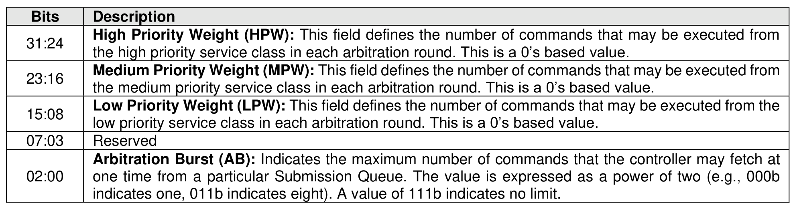

###### 5.2.26.1.1 Arbitration (Feature Identifier 01h)

> **Section ID**: 5.2.26.1.1 | **Page**: 426-426

This Feature controls command arbitration within the controller. Refer to section 3.4.4 for command
arbitration details. The attributes are specified in Command Dword 11.
If a Get Features command is submitted for this Feature, the attributes specified in Figure 404 are returned
in Dword 0 of the completion queue entry for that command.

---
### 📊 Tables (1)

#### Table 1: Untitled Table

| | |
| :--- | :--- |
| | Medium Priority Weight (MPW): This field defines the number of commands that may be executed from the medium priority service class in each arbitration round. This is a 0's based value. |
| | Low Priority Weight (LPW): This field defines the number of commands that may be executed from the low priority service class in each arbitration round. This is a 0's based value. |
| | Reserved |
| | Arbitration Burst (AB): Indicates the maximum number of commands that the controller may fetch at one time from a particular Submission Queue. The value is expressed as a power of two (e.g., 000b indicates one, 011b indicates eight). A value of 111b indicates no limit. |
| 2.2 | Power Management (Feature Identifier 02h) |
| | feature allows the host to configure the controller power state. The attributes are specified in |
| | and Dword 11 (refer to Figure 405). |
| | successful completion of a Set Features command for this Feature, the controller shall be in the |
| | state specified. For a transition to a non-operational power state, the device may exceed the power |

