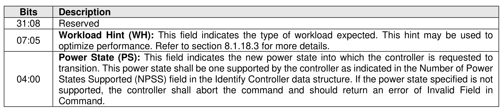
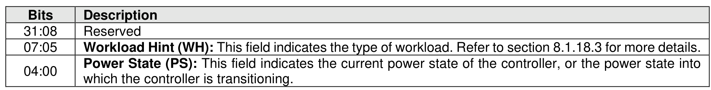

###### 5.2.26.1.2 Power Management (Feature Identifier 02h)

> **Section ID**: 5.2.26.1.2 | **Page**: 426-426

This Feature allows the host to configure the controller power state. The attributes are specified in
Command Dword 11 (refer to Figure 405).
Upon successful completion of a Set Features command for this Feature, the controller shall be in the
Power State specified. For a transition to a non-operational power state, the device may exceed the power
indicated for that non-operational power state as defined in section 8.1.18.1 (e.g., while completing this
command). If enabled, autonomous power state transitions continue to occur from the new state.
If a Get Features command is submitted for this Feature, the attributes described in Figure 406 are returned
in Dword 0 of the completion queue entry for that command.

---
### 📊 Tables (2)

#### Table 1: Untitled Table

| Description |  |
| :--- | :--- |
| Reserved |  |
| **Workload Hint (WH):** This field indicates the type of workload. Refer to section 8.1.18.3 for more details. |  |
| **Power State (PS):** This field indicates the current power state of the controller, or the power state into which the controller is transitioning. |  |

#### Table 2: Untitled Table

(Continuation of Untitled Table - see first part)

