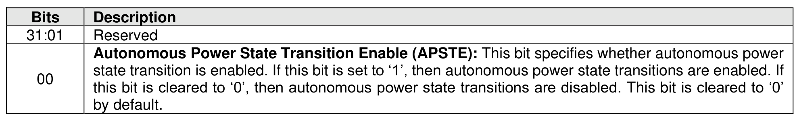
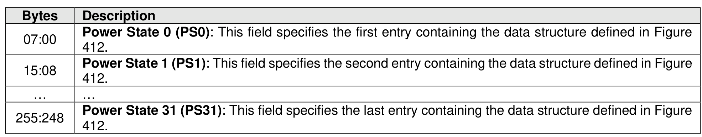
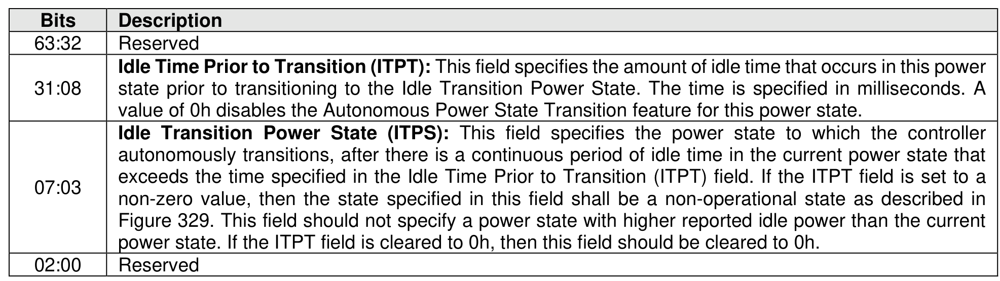
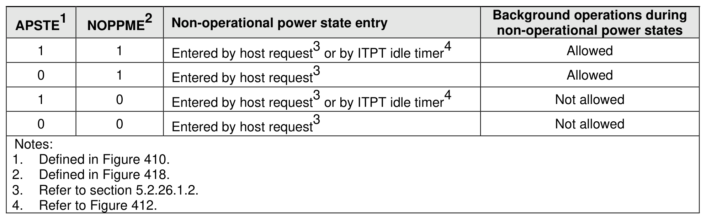

###### 5.2.26.1.6 Autonomous Power State Transition (Feature Identifier 0Ch)

> **Section ID**: 5.2.26.1.6 | **Page**: 431-432

This Feature configures the settings for autonomous controller power state transitions, refer to section
8.1.18.2.
This Feature uses Command Dword 11 to specify the attribute information defined in Figure 410. This
Feature uses the data buffer that contains the Autonomous Power State Transition data structure consisting
of 32 of the entries as defined in Figure 411.
If a Get Features command is issued for this Feature, the attributes specified in Figure 410 are returned in
Dword 0 of the completion queue entry and the Autonomous Power State Transition data structure, as
defined in Figure 411, is returned in the data buffer for that command.
The Autonomous Power State Transition data structure is defined in Figure 411. There is an entry for each
of the allowable power states where the contents of each entry is defined in Figure 412. For power states
that are not supported, the unused Autonomous Power State Transition data structure entries shall be
cleared to all zeroes.
The Autonomous Power State Transition feature may interact with the Non-Operational Power State Config
feature (refer to section 5.2.26.1.10). Figure 413 shows these interactions.

---
### 📊 Tables (4)

#### Table 1: Untitled Table

| Description | | | |
| :--- | :--- | :--- | :--- |
| Power State 0 (PS0): This field specifies the first entry containing the data structure defined in Figure 412. | | | |
| Power State 1 (PS1): This field specifies the second entry containing the data structure defined in Figure 412. | | | |
| | | | |
| | | | |
| Idle Time Prior to Transition (ITPT): This field specifies the amount of idle time that occurs in this power state prior to transitioning to the Idle Transition Power State. The time is specified in milliseconds. A value of 0h disables the Autonomous Power State Transition feature for this power state. | | | |
| Idle Transition Power State (ITPS): This field specifies the power state to which the controller autonomously transitions, after there is a continuous period of idle time in the current power state that exceeds the time specified in the Idle Time Prior to Transition (ITPT) field. If the ITPT field is set to a non-zero value, then the state specified in this field shall be a non-operational state as described in Figure 329. This field should not specify a power state with higher reported idle power than the current power state. If the ITPT field is cleared to 0h, then this field should be cleared to 0h. | | | |
| Reserved | | | |
| | | | |
| | | | |
| | | | |
| | | | |
| | | | |
| |

#### Table 2: Untitled Table

(Continuation of Untitled Table - see first part)

#### Table 3: Untitled Table

(Continuation of Untitled Table - see first part)

#### Table 4: Untitled Table

(Continuation of Untitled Table - see first part)

