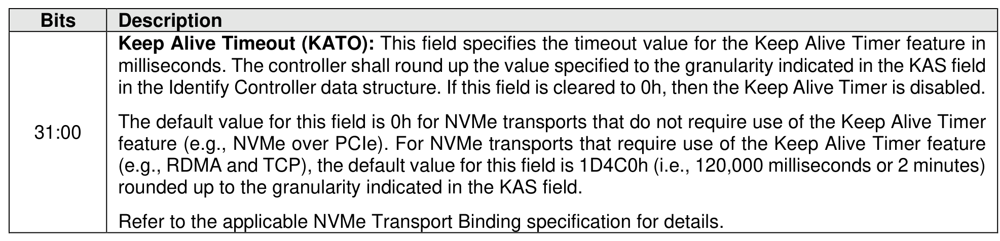

###### 5.2.26.1.8 Keep Alive Timer (Feature Identifier 0Fh)

> **Section ID**: 5.2.26.1.8 | **Page**: 433-434

This Feature configures the controller Keep Alive Timer. Refer to section 3.9 for Keep Alive details. The
attributes are specified in Command Dword 11.
If a Get Features command is submitted for this Feature, the attributes specified in Figure 416 are returned
in Dword 0 of the completion queue entry for that command.

---
### 📊 Tables (1)

#### Table 1: Untitled Table

| | |
| :--- | :--- |
| | milliseconds. The controller shall round up the value specified to the granularity indicated in the KAS field in the Identify Controller data structure. If this field is cleared to 0h, then the Keep Alive Timer is disabled. |
| | The default value for this field is 0h for NVMe transports that do not require use of the Keep Alive Timer feature (e.g., NVMe over PCIe). For NVMe transports that require use of the Keep Alive Timer feature (e.g., RDMA and TCP), the default value for this field is 1D4C0h (i.e., 120,000 milliseconds or 2 minutes) rounded up to the granularity indicated in the KAS field. |
| | Refer to the applicable NVMe Transport Binding specification for details. |
| 8.9 | Host Controlled Thermal Management (Feature Identifier 10h) |
| | Feature configures the controller settings for the host controlled thermal management feature, refer to 8.1.18.5. The host controlled thermal management feature uses Command Dword 11 with the |

