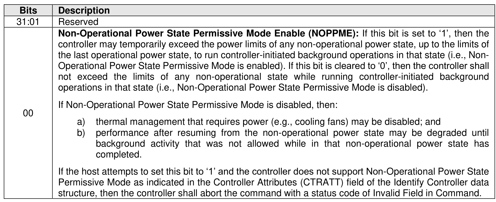

###### 5.2.26.1.10 Non-Operational Power State Config (Feature Identifier 11h)

> **Section ID**: 5.2.26.1.10 | **Page**: 435-435

This Feature configures non-operational power state settings for the controller. The settings are specified
in Command Dword 11.
If a Get Features command is submitted for this Feature, the values in Figure 418 are returned in Dword 0
of the completion queue entry for that command.
The Non-Operational Power State Config feature may interact with the Autonomous Power State Transition
feature (refer to section 5.2.26.1.6). Figure 413 shows these interactions.

---
### 📊 Tables (1)

#### Table 1: Untitled Table

| | |
| :--- | :--- |
| | controller may temporarily exceed the power limits of any non-operational power state, up to the limits of the last operational power state, to run controller-initiated background operations in that state (i.e., Non-Operational Power State Permissive Mode is enabled). If this bit is cleared to '0', then the controller shall not exceed the limits of any non-operational state while running controller-initiated background operations in that state (i.e., Non-Operational Power State Permissive Mode is disabled). |
| | If Non-Operational Power State Permissive Mode is disabled, then: |
| | a) thermal management that requires power (e.g., cooling fans) may be disabled; and |
| | b) performance after resuming from the non-operational power state may be degraded until background activity that was not allowed while in that non-operational power state has completed. |
| | If the host attempts to set this bit to '1' and the controller does not support Non-Operational Power State Permissive Mode as indicated in the Controller Attributes (CTRATT) field of the Identify Controller data structure, then the controller shall abort the command with a status code of Invalid Field in Command. |
| | -Operational Power State Config feature may interact with the Autonomous Power State Transition refer to section 5.2.26.1.6). Figure 413 shows these interactions. |
| | .11 Read Recovery Level Config (Feature Identifier 12h) |
| | ture is used to configure the Read Recovery Level (refer to section 8.1.22). The attributes are d in Command Dword 11 and Command Dword 12. Modifying the Read Recovery Level has no the data contained in any associated namespace. |

