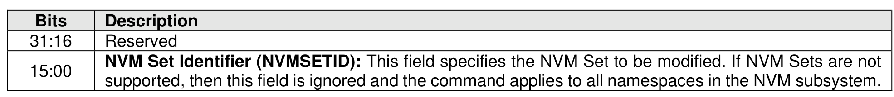
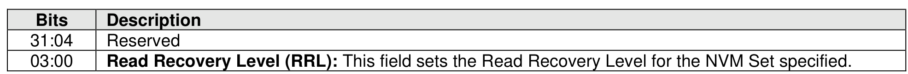

###### 5.2.26.1.11 Read Recovery Level Config (Feature Identifier 12h)

> **Section ID**: 5.2.26.1.11 | **Page**: 435-435

This Feature is used to configure the Read Recovery Level (refer to section 8.1.22). The attributes are
specified in Command Dword 11 and Command Dword 12. Modifying the Read Recovery Level has no
effect on the data contained in any associated namespace.
The scope of this Feature is:
•
NVM Set if NVM Sets are supported; or
•
NVM Subsystem if NVM Sets are not supported.
If a Get Features command is submitted for this Feature, the attributes specified in Figure 420 are returned
in Dword 0 of the completion queue entry for that command.

---
### 📊 Tables (2)

#### Table 1: Untitled Table

| 411 |

#### Table 2: Untitled Table

(Continuation of Untitled Table - see first part)

