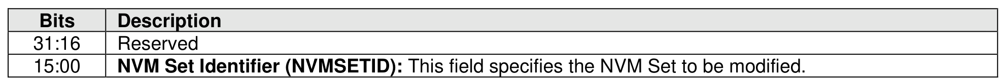
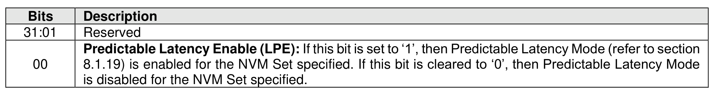
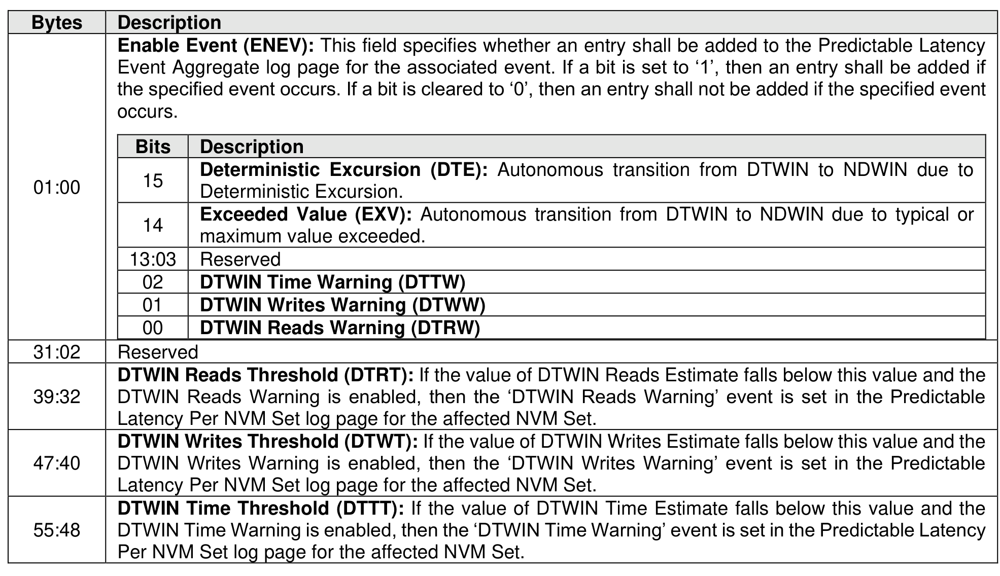
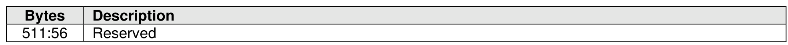

###### 5.2.26.1.12 Predictable Latency Mode Config (Feature Identifier 13h)

> **Section ID**: 5.2.26.1.12 | **Page**: 436-437

This Feature configures an NVM Set to use Predictable Latency Mode, including warning event thresholds.
Predictable Latency Mode and events are disabled by default. The attributes are specified in Command
Dword 11, Command Dword 12, and the Deterministic Threshold Configuration data structure.
The NVM Set has transitioned to Predictable Latency Mode when the controller completes a Set Features
command successfully with the Predictable Latency Enable bit in Command Dword 12 set to ‘1’. A transition
to the Predictable Latency Mode may be delayed (i.e., the Set Features command completion is delayed)
if the NVM subsystem needs to perform background operations on the NVM in order to operate in
Predictable Latency Mode. Upon successful completion of this command, the controller shall be in the Non-
Deterministic Window.
If a Get Features command is submitted for this Feature, the attributes specified in Figure 422 are returned
in Dword 0 of the completion queue entry for that command and the Deterministic Threshold Configuration
data structure is returned.
Predictable Latency Events (refer to section 5.2.12.1.12) are configured as described in Figure 423.

---
### 📊 Tables (4)

#### Table 1: Untitled Table

| Description | |
| :--- | :--- |
| Reserved | |
| Predictable Latency Enable (LPE): If this bit is set to '1', then Predictable Latency Mode (refer to section 8.1.19) is enabled for the NVM Set specified. If this bit is cleared to '0', then Predictable Latency Mode | |
| | |
| | |
| | |
| | |
| | |
| | |
| | |
| | |
| | |
| |

#### Table 2: Untitled Table

(Continuation of Untitled Table - see first part)

#### Table 3: Untitled Table

(Continuation of Untitled Table - see first part)

#### Table 4: Untitled Table

(Continuation of Untitled Table - see first part)

