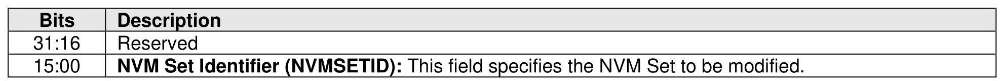
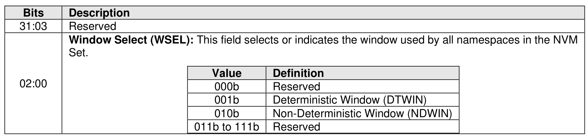

###### 5.2.26.1.13 Predictable Latency Mode Window (Feature Identifier 14h)

> **Section ID**: 5.2.26.1.13 | **Page**: 437-437

This Feature is used to set the window for the specified NVM Set and its associated namespaces if the
NVM Set is configured in Predictable Latency Mode (refer to section 8.1.19). The attributes are specified in
Command Dword 11 and Command Dword 12. If Predictable Latency Mode is not enabled, then the
controller shall abort the command with a status code of Invalid Field in Command.
The transition to the window selected is complete when the Set Features command completes successfully.
A transition to the Deterministic Window may be delayed (i.e., the Set Features command completion is
delayed) if the minimum time has not been spent in the Non-Deterministic Window.
If a Get Features command is submitted for this Feature, the attributes specified in Figure 425 are returned
in Dword 0 of the completion queue entry for that command. If Predictable Latency Mode is not enabled,
then the controller shall abort the command with a status code of Invalid Field in Command.

---
### 📊 Tables (2)

#### Table 1: Untitled Table

| Description |  |
| :--- | :--- |
| | Reserved |
| | **Window Select (WSEL):** This field selects or indicates the window used by all namespaces in the NVM Set. |
| | <table> <tr> <th>Value</th> <th>Definition</th> </tr> <tr> <td>011b to 111b</td> <td>Reserved</td> </tr> </table> |

#### Table 2: Untitled Table

(Continuation of Untitled Table - see first part)

