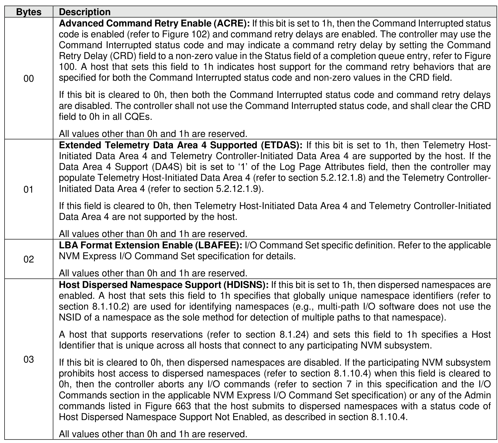
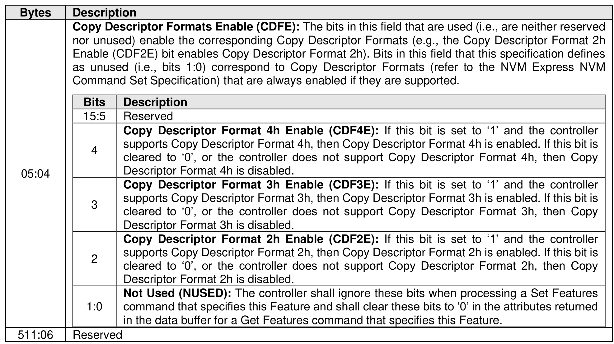

###### 5.2.26.1.14 Host Behavior Support (Feature Identifier 16h)

> **Section ID**: 5.2.26.1.14 | **Page**: 437-439

This Feature enables use of controller functionality that is associated with and depends upon specific host
behavior that may or may not be supported by all hosts. A controller does not use such functionality unless
the host has indicated that the host supports the specific host behavior upon which the functionality
depends. The host indicates that support to the controller by setting a field in this Feature. That host action
enables controller use of the associated functionality with that host. A controller shall not use functionality
with a host that has not indicated support for the associated specific host behavior upon which that controller
functionality depends. The attributes in Figure 426 are transferred in the data buffer.
For example, the Command Interrupted status code is associated with and depends upon the specific host
behavior that the host is expected to retry commands that are aborted with that status code. That command
retry behavior may or may not be supported by all hosts (e.g., hosts compliant with versions 1.3 and earlier
of the NVM Express Base Specification are unlikely to retry commands aborted with the Command
Interrupted status code as that status code was introduced after NVM Express Base Specification, Revision
1.3). A host that supports that command retry behavior indicates its support to the controller by setting a
field to 1h in the Host Behavior Support Feature. Setting that field to 1h enables controller use of the
Command Interrupted status code, with the result that this status code is used only with hosts that have
indicated support for the associated command retry behavior.
This Feature is not saveable (refer to Figure 199). The default value of this Feature shall be all bytes cleared
to 0h.
After a successful completion of a Set Features command for this Feature, the controller may use controller-
to-host functionality that depends on specific host behavior as indicated by the attributes. If multiple Set
Features commands for this Feature are processed by the controller, only information from the most recent
successful command is retained (i.e., subsequent commands replace information provided by previous
commands).
If a Get Features command is submitted for this Feature, the attributes specified in Figure 426 are returned
in the data buffer for that command.

---
### 📊 Tables (2)

#### Table 1: Untitled Table

| Bits | Description |
|:---|:---|
| 15:5 | Reserved |
| 4 | **Copy Descriptor Format 4h Enable (CDF4E):** If this bit is set to '1' and the controller supports Copy Descriptor Format 4h, then Copy Descriptor Format 4h is enabled. If this bit is cleared to '0', or the controller does not support Copy Descriptor Format 4h, then Copy Descriptor Format 4h is disabled. |
| 3 | **Copy Descriptor Format 3h Enable (CDF3E):** If this bit is set to '1' and the controller supports Copy Descriptor Format 3h, then Copy Descriptor Format 3h is enabled. If this bit is cleared to '0', or the controller does not support Copy Descriptor Format 3h, then Copy Descriptor Format 3h is disabled. |
| 2 | **Copy Descriptor Format 2h Enable (CDF2E):** If this bit is set to '1' and the controller supports Copy Descriptor Format 2h, then Copy Descriptor Format 2h is enabled. If this bit is cleared to '0', or the controller does not support Copy Descriptor Format 2h, then Copy Descriptor Format 2h is disabled. |
| 1:0 | **Not Used (NUSED):** The controller shall ignore these bits when processing a Set Features command that specifies this Feature and shall clear these bits to '0' in the attributes returned in the data buffer for a Get Features command that specifies this Feature. |
| | Reserved |

#### Table 2: Untitled Table

(Continuation of Untitled Table - see first part)

