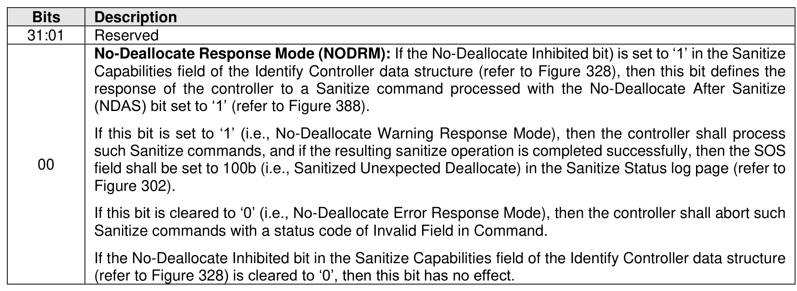

###### 5.2.26.1.15 Sanitize Config (Feature Identifier 17h)

> **Section ID**: 5.2.26.1.15 | **Page**: 439-439

This Feature controls behavior of the Sanitize command and sanitize operations. The scope of this Feature
is the NVM subsystem.
The attributes are specified in Command Dword 11.
If a Get Features command is submitted for this Feature, the attributes specified in Figure 427 are returned
in Dword 0 of the completion queue entry for that command.
If this Feature is not saveable (refer to Figure 199), then the default value of the NODRM attribute shall be
cleared to ‘0’ (i.e., No-Deallocate Error Response Mode).
If the capabilities of the Sanitize Config Feature Identifier are both changeable and saveable (refer to
section 4.4), then the host is able to configure this Feature when initially provisioning a device.

---
### 📊 Tables (1)

#### Table 1: Untitled Table

| If the No-Deallocate Inhibited bit in the Sanitize Capabilities field of the Identify Controller data structure (refer to Figure 328) is cleared to '0', then this bit has no effect. |
|---|
| 415 |

