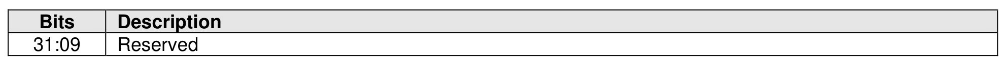
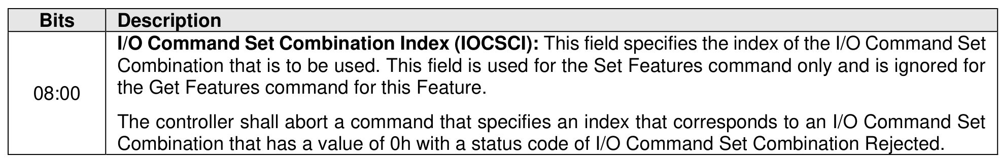
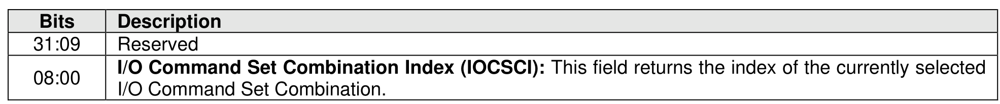

###### 5.2.26.1.17 I/O Command Set Profile (Feature Identifier 19h)

> **Section ID**: 5.2.26.1.17 | **Page**: 440-441

This Feature specifies the I/O Command Sets that may be used by the controller when all supported I/O
Command Sets (110b) are selected in CC.CSS. This Feature shall be implemented if the CAP.CSS.IOCSS
bit is set to ‘1’. When CC.CSS is set to any value other than 110b, then this Feature has no effect and the
I/O Command Sets that may be used by the controller are specified by CC.CSS. If CC.CSS is set to any
value other than 110b and the controller receives a Set Features command for this Feature, then this
command has no effect and returns a status code of Successful Completion.
When all supported I/O Command Sets (110b) is selected in CC.CSS, the value of this Feature specifies
the index of the I/O Command Set Combination in the Identify I/O Command Set data structure that is used.
Refer to section 5.2.13.2.19 for more information. The Index is specified in the I/O Command Set
Combination Index field of Command Dword 11 (refer to Figure 429). If any namespace attached to the
controller uses an I/O Command Set that is not supported by the specified I/O Command Set combination,
then the controller shall abort the command with a status code of I/O Command Set Combination Rejected.
Upon successful completion of a Set Features command for this Feature, the controller transitions to using
the specified I/O Command Set Combination.
If a Get Features command is submitted for this Feature, then the attributes described in Figure 430 are
returned in Dword 0 of the completion queue entry for that command.

---
### 📊 Tables (3)

#### Table 1: Untitled Table

| | |
| :--- | :--- |
| | Combination that is to be used. This field is used for the Set Features command only and is ignored for the Get Features command for this Feature. |
| | The controller shall abort a command that specifies an index that corresponds to an I/O Command Set Combination that has a value of 0h with a status code of I/O Command Set Combination Rejected. |
| | Features command is submitted for this Feature, then the attributes described in Figure 430 are in Dword 0 of the completion queue entry for that command. |
| 8.1.18 Spinup Control (Feature Identifier 1An) | |
| | This feature allows the host to configure the method for initial spinup for Endurance Groups that store data on rotational media (refer to section 8.1.25). |
| | If the NVM subsystem does not contain any Endurance Groups that store data on rotational media, then the controller shall abort the Set Features command and the Get Features command for this Feature with |

#### Table 2: Untitled Table

(Continuation of Untitled Table - see first part)

#### Table 3: Untitled Table

(Continuation of Untitled Table - see first part)

