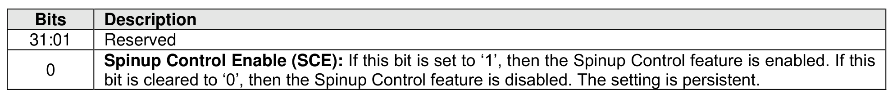
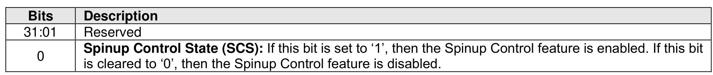

###### 5.2.26.1.18 Spinup Control (Feature Identifier 1Ah)

> **Section ID**: 5.2.26.1.18 | **Page**: 441-441

This Feature allows the host to configure the method for initial spinup for Endurance Groups that store data
on rotational media (refer to section 8.1.25).
If the NVM subsystem does not contain any Endurance Groups that store data on rotational media, then
the controller shall abort the Set Features command and the Get Features command for this Feature with
status code of Invalid Field in Command.
The method is specified in Command Dword 11 (refer to Figure 431).
If a Get Features command is submitted for this Feature, the attributes described in (refer to Figure 432)
are returned in Dword 0 of the completion queue entry for that command.

---
### 📊 Tables (2)

#### Table 1: Untitled Table

| Description |
|:---|
| Reserved |
| **Spinup Control State (SCS):** If this bit is set to ‘1’, then the Spinup Control feature is enabled. If this bit is cleared to ‘0’, then the Spinup Control feature is disabled. |

#### Table 2: Untitled Table

(Continuation of Untitled Table - see first part)

