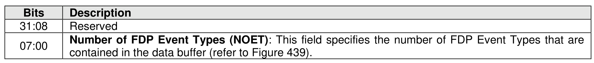
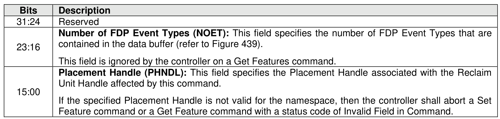
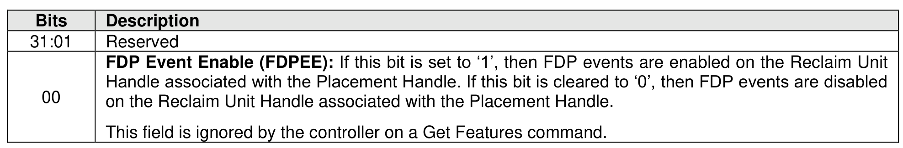
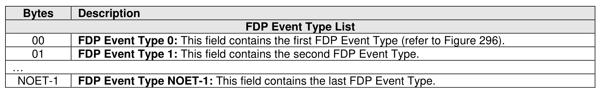
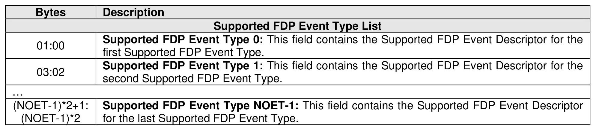
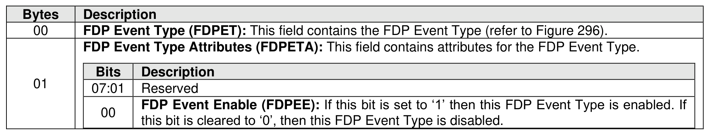

###### 5.2.26.1.21 Flexible Data Placement Events (Feature Identifier 1Eh)

> **Section ID**: 5.2.26.1.21 | **Page**: 443-444

This Feature controls if a controller generates Flexible Data Placement (FDP) events associated with a
specific Reclaim Unit Handle. The Reclaim Unit Handle is the Reclaim Unit Handle associated with the
specified Placement Handle for the specified namespace. For a Set Features command, the data buffer
contains the list of FDP Event Types that are to be enabled or disabled as defined in Figure 439.
The attribute is specified in Command Dword 12. Effects of enabling and disabling FDP events on the
Reclaim Unit Handles are described in section 8.1.11.
If Flexible Data Placement is disabled, then the controller shall abort any Set Feature command or Get
Feature command specifying this Feature with a status code of FDP Disabled.
If the NSID field is set to FFFFFFFFh, then the controller shall abort the command with a status code of
Invalid Field in Command.
If a Get Features command specifying this Feature is successfully completed, then the attributes for the
supported list of FDP Event Types described in Figure 440 is returned in the data buffer and Dword 0 of
the completion queue entry contains the value of NOET (i.e., the number of supported FDP Event Types
that are contained in the data buffer). Completion queue entry Dword 0 is defined in Figure 436. The
supported list of FDP Event Types shall be listed in ascending order of FDP Event Type.
This Feature shall be saveable (refer to section 4.4).
If:
•
a Reclaim Unit Handle is shared by more than one namespace that exists in the same Endurance
Group; and
•
a Set Features command specifies this Feature and one of those namespaces,
then a modification to this Feature occurs to that shared Reclaim Unit Handle and the Placement Handle
that is associated with the shared Reclaim Unit Handle.

---
### 📊 Tables (6)

#### Table 1: Untitled Table

| Description | |
| :--- | :--- |
| Reserved | |
| Number of FDP Event Types (NOET): This field specifies the number of FDP Event Types that are contained in the data buffer (refer to Figure 439). This field is ignored by the controller on a Get Features command. | |
| Feature command or a Get Feature command with a status code of Invalid Field in Command. | |
| | |
| | |
| | |
| | |
| | |
| | |
| | |
| | |
| | |
| |

#### Table 2: Untitled Table

(Continuation of Untitled Table - see first part)

#### Table 3: Untitled Table

(Continuation of Untitled Table - see first part)

#### Table 4: Untitled Table

(Continuation of Untitled Table - see first part)

#### Table 5: Untitled Table

(Continuation of Untitled Table - see first part)

#### Table 6: Untitled Table

(Continuation of Untitled Table - see first part)

