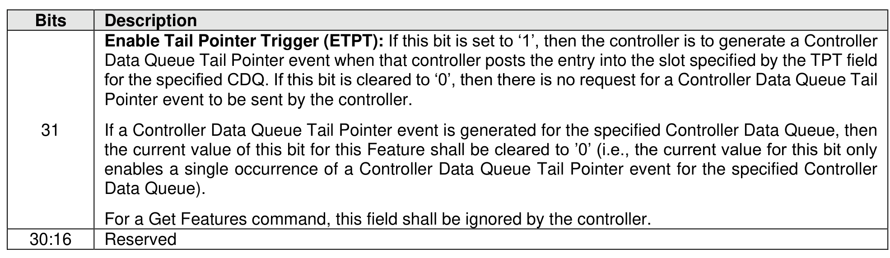
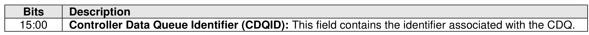
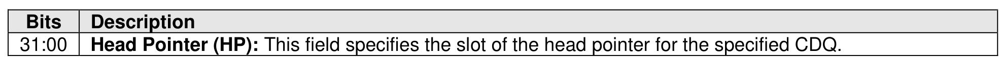
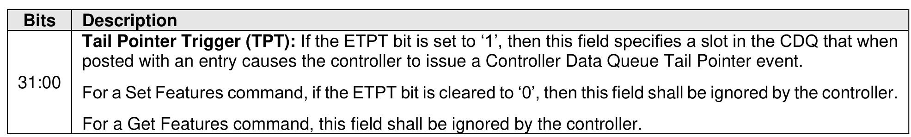

###### 5.2.26.1.23 Controller Data Queue (Feature Identifier 21h)

> **Section ID**: 5.2.26.1.23 | **Page**: 445-446

This Feature allows a host to update the status of the head pointer of a Controller Data Queue (CDQ) and
specify the configuration of a Controller Data Queue Tail event. The CDQ is specified by the Controller
Data Queue Identifier (CDQID) field in Command Dword 11 (refer to Figure 443).
The Head Pointer field specifies the current slot of the head pointer in the queue (refer to section 8.1.7)
The controller uses this value to determine if CDQ entries have been freed by the host.
If the Enable Tail Pointer Trigger (ETPT) bit is set to ‘1’, then when the slot specified by the Tail Pointer
Trigger (TPT) field for the specified CDQ is posted with an entry, the controller shall generate a Controller
Data Queue Tail Pointer event to the host (refer to section 8.1.7).
If the Set Features command is successful and there is a pending Controller Data Queue Tail Pointer event
for the specified Controller Data Queue specified by the CDQID field, then the controller shall clear that
pending event.
A controller should report Controller Data Queue Tail Pointer events in the order of occurrence to avoid
reporting the same Controller Data Queue when a Controller Data Queue Tail Pointer event for that
Controller Data Queue is being repeatedly triggered.
If the Enable Tail Pointer Trigger (ETPT) bit is set to ‘1’ in the current value of this Feature (refer to section
4.4) and the controller processes a Set Features command for this Feature that specifies:
•
the Enable Tail Pointer Trigger (ETPT) bit set to ‘1’; and
•
a slot in the Tail Pointer Trigger (TPT) field,
then prior to posting the completion for that Set Features command, the controller may post an entry into
the specified CDQ in the slot specified by the value of the TPT field that had been set prior to processing
that Set Features command. To detect this condition, after receiving the completion of that Set Features
command, a host should examine the CDQ to determine if the requested tail pointer trigger has already
occurred. If the requested tail pointer trigger has occurred, then a subsequent Set Features command
should be submitted by the host to disable the Tail Pointer Trigger event or request a different tail pointer
trigger.
If a Get Features command is submitted for this Feature, the attributes described in Figure 443 are returned
in Dword 0 of the completion queue entry and the attributes described in Figure 447 are returned in the
data buffer for that command.
If the CDQ is empty (refer to section 3.3.1.4) and the Head Pointer field specifies a value that is not the
same value as the current value, then the controller shall abort the command with a status code of Invalid
Field in Command.
If the CDQ is not empty and the Head Pointer field specifies a slot not associated with an entry that was
posted by the controller within the specified CDQ, then the controller shall abort the command with a status
code of Invalid Field in Command.
If the Enable Tail Pointer Trigger bit is set to ‘1’ and the Tail Pointer Trigger field specifies a slot not
associated with an entry within the specified CDQ, then the controller shall abort the command with a
status code of Invalid Field in Command.
If the value in the Controller Data Queue Identifier field specifies a CDQ that does not exist in the controller
processing the command, then the controller shall abort the command with a status code of Invalid
Controller Data Queue.

---
### 📊 Tables (5)

#### Table 1: Untitled Table

| Personality Identifier | Definition | Uses the data buffer¹ | Reference Section |
| :--- | :--- | :--- | :--- |
| 00h | Manufacturing Default Personality | N | 5.2.26.1.24.2 |

#### Table 2: Untitled Table

(Continuation of Untitled Table - see first part)

#### Table 3: Untitled Table

(Continuation of Untitled Table - see first part)

#### Table 4: Untitled Table

(Continuation of Untitled Table - see first part)

#### Table 5: Untitled Table

(Continuation of Untitled Table - see first part)

