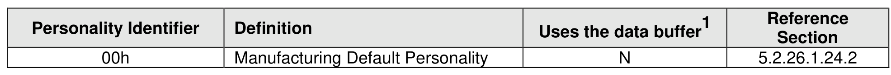
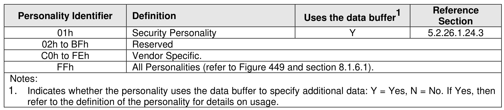
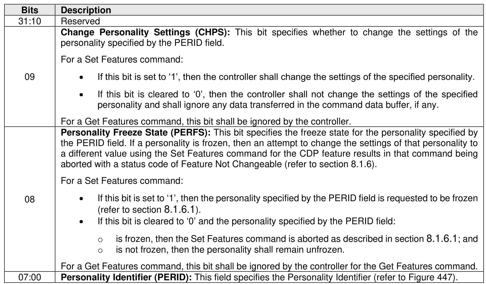
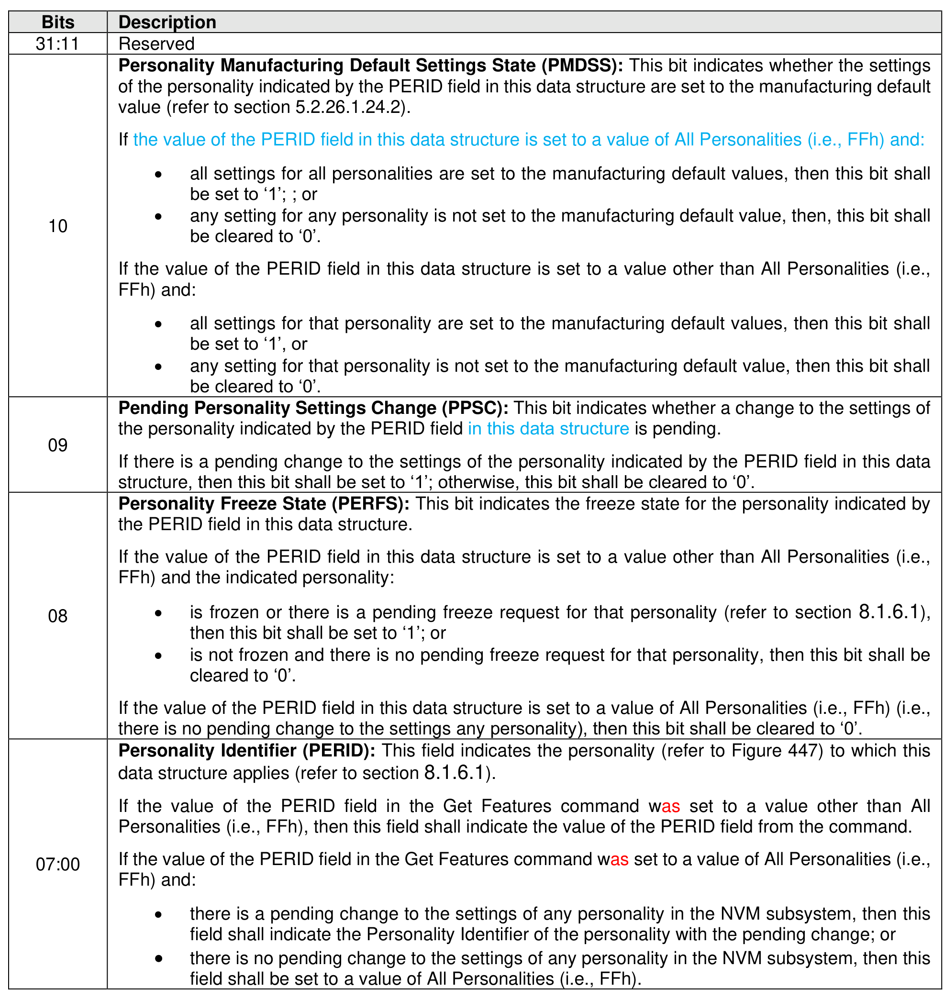

###### 5.2.26.1.24 Configurable Device Personality (Feature Identifier 22h)

> **Section ID**: 5.2.26.1.24 | **Page**: 446-449

This Feature controls the operation of the Configurable Device Personality (CDP) capability (refer to section
8.1.6). The Set Features command allows a host to change the settings of a device personality in the NVM
subsystem and the Get Features command allows a host to discover the settings for a device personality.
Figure 447 defines personalities that are able to be supported by an NVM subsystem. Each personality
may have multiple configurations.
The attributes for this Feature are specified in Command Dword 13 (refer to Figure 448). The effects on an
NVM subsystem as a result of making a change to the settings of the specified personality are described
in section 8.1.6.
The Set Features command and the Get Features command may transfer additional data in the command
data buffer as defined by each personality (refer to Figure 447).
If a Get Features command completes successfully for this Feature, then:
•
the current attributes for the personality specified by the PERID field in that Get Features command
shall be returned in Dword 0 of the completion queue entry for that command (refer to Figure 449);
and
•
if the personality specified in the PERID field in Command Dword 13 defines settings in the data
buffer (as indicated in Figure 447), then those personality settings shall correspond to the current
settings for that personality.
If a personality that is not supported (refer to Figure 285) is specified in the PERID field in Command Dword
13, then the controller shall abort the command with a status code of Invalid Field in Command.
If the personality (i.e., the PERID field in Command Dword 13) is set to the All Personalities value (i.e., FFh)
and the Change Personality Settings (CHPS) bit is set to ‘1’ for a Set Features command, then the controller
shall abort the command with a status code of Invalid Field in Command.
This Feature is not saveable and is persistent (refer to Figure 396). The settings for each personality shall
persist across power cycles and resets unless modified by the mechanisms described in this section.
A personality is able to be frozen. If a personality is frozen, then the settings of that personality are not
allowed to be changed. If an authentication method is supported by that personality, as described in section
5.2.26.1.24.1, then that frozen personality is able to be unfrozen. If no authentication method is supported
by that personality, then that frozen personality is permanently frozen.
NVM Express does not provide any guidance on whether modifying the NVM subsystem by changing the
settings of a personality affects compliance with any applicable laws, specifications, or other requirements.

---
### 📊 Tables (4)

#### Table 1: Untitled Table

| 01h | Security Personality | Y | 5.2.26.1.24.3 |
|---|---|---|---|
| 02h to BFh | Reserved | | |
| C0h to FEh | Vendor Specific. | | |
| FFh | All Personalities (refer to Figure 449 and section 8.1.6.1). | | |
| | Indicates whether the personality uses the data buffer to specify additional data: Y = Yes, N = No. If Yes, then refer to the definition of the personality for details on usage. | | |
| | Routes for this Feature are specified in Command Dword 13 (refer to Figure 448). The effects on an subsystem as a result of making a change to the settings of the specified personality are described in 8.1.6. | | |
| | • If this bit is cleared to '0', then the controller shall not change the settings of the specified personality and shall ignore any data transferred in the command data buffer, if any.   For a Get Features command, this bit shall be ignored by the controller. | | |
| | **Personality Freeze State (PERFS):** This bit specifies the freeze state for the personality specified by the PERID field. If a personality is frozen, then an attempt to change the settings of that personality to a different value using the Set Features command for the CDP feature results in that command being aborted with a status code of Feature Not Changeable (refer to section 8.1.6).   For a Set Features command:   • If this bit is set to '1', then the personality specified by the PERID field is requested to be frozen (refer to section 8.1.6.1).   • If this bit is cleared to '0' and the personality specified by the PERID field:   o is frozen, then the Set Features command is aborted as described in section 8.1.6.1; and   o is not frozen, then the personality shall remain unfrozen.   For a Get Features command, this bit shall be ignored by the controller for the Get Features command. | | |
| | **Personality Identifier (PERID):** This field specifies the Personality Identifier (refer to Figure 447). | | |
| | Features command completes successfully for this Feature, then:   the current attributes for the personality specified by the PERID field in that Get Features command shall be returned in Dword 0 of the completion queue entry for that command (refer to Figure 449); and   if the personality specified in the PERID field in Command Dword 13 defines settings in the data buffer (as indicated in Figure 447), then those personality settings shall correspond to the current settings for that personality.   If a personality that is not supported (refer to Figure 285) is specified in the PERID field in Command Dword 13, then the controller shall abort the command with a status code of Invalid Field in Command. | | |
| | **Personality Manufacturing Default Settings State (PMDSS):** This bit indicates whether the settings of the personality indicated by the PERID field in this data structure are set to the manufacturing default value (refer to section 5.2.26.1.24.2).   If the value of the PERID field in this data structure is set to a value of All Personalities (i.e., FFh) and:   • all settings for all personalities are set to the manufacturing default values, then this bit shall be set to '1'; or   • any setting for any personality is not set to the manufacturing default value, then this bit shall be cleared to '0'.   If the value of the PERID field in this data structure is set to a value other than All Personalities (i.e., FFh) and:   • all settings for that personality are set to the manufacturing default values, then this bit shall be set to '1'; or   • any setting for that personality is not set to the manufacturing default value, then this bit shall be cleared to '0'. | | |
| | **Pending Personality Settings Change (PPSC):** This bit indicates whether a change to the settings of the personality indicated by the PERID field in this data structure is pending.   If there is a pending change to the settings of the personality indicated by the PERID field in this data structure, then this bit shall be set to '1'; otherwise, this bit shall be cleared to '0'. | | |
| | **Personality Freeze State (PERFS):** This bit indicates the freeze state for the personality indicated by the PERID field in this data structure.   If the value of the PERID field in this data structure is set to a value other than All Personalities (i.e., FFh) and the indicated personality:   • is frozen or there is a pending freeze request for that personality (refer to section 8.1.6.1), then this bit shall be set to '1'; or   • is not frozen and there is no pending freeze request for that personality, then this bit shall be cleared to '0'.   If the value of the PERID field in this data structure is set to a value of All Personalities (i.e., FFh) (i.e., there is no pending change to the settings any personality), then this bit shall be cleared to '0'. | | |
| | **Personality Identifier (PERID):** This field indicates the personality (refer to Figure 447) to which this data structure applies (refer to section 8.1.6.1).   If the value of the PERID field in the Get Features command was set to a value other than All Personalities (i.e., FFh), then this field shall indicate the value of the PERID field from the command.   If the value of the PERID field in the Get Features command was set to a value of All Personalities (i.e., FFh) and:   • there is a pending change to the settings of any personality in the NVM subsystem, then this field shall indicate the Personality Identifier of the personality with the pending change; or   • there is no pending change to the settings of any personality in the NVM subsystem, then this field shall be set to a value of All Personalities (i.e., FFh). | | |
| | Feature is not saveable and is persistent (refer to Figure 396). The settings for each personality shall cross power cycles and resets unless modified by the mechanisms described in this section.   A personality is able to be frozen. If a personality is frozen, then the settings of that personality are not to be changed. If an authentication method is supported by that personality, as described in section 5.2.26.1.24.1, then that frozen personality is able to be unfrozen. If no authentication method is supported by that personality, then that frozen personality is permanently frozen. | | |

#### Table 2: Untitled Table

(Continuation of Untitled Table - see first part)

#### Table 3: Untitled Table

(Continuation of Untitled Table - see first part)

#### Table 4: Untitled Table

(Continuation of Untitled Table - see first part)

