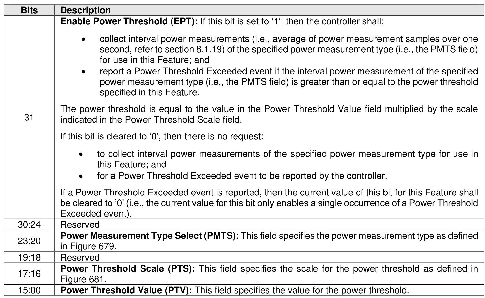

###### 5.2.26.1.26 Power Threshold (Feature Identifier 24h)

> **Section ID**: 5.2.26.1.26 | **Page**: 454-454

This Feature controls if a controller reports a Power Threshold Exceeded event and the power threshold
used by the controller to trigger that Power Threshold Exceeded event.
If a Set Features command is issued specifying this Feature, then the attributes are specified in Command
Dword 11 (refer to Figure 453).
This Feature shall be saveable (refer to Figure 199). The default value of this Feature shall be all bytes
cleared to 0h.
If a Get Features command is issued specifying this Feature, then the attributes described in Figure 453
are returned in Dword 0 of the completion queue entry for that command.

---
### 📊 Tables (1)

#### Table 1: Untitled Table

| | |
| :--- | :--- |
| The power threshold is equal to the value in the Power Threshold Value field multiplied by the scale indicated in the Power Threshold Scale field. | |
| If this bit is cleared to '0', then there is no request: | |
| • to collect interval power measurements of the specified power measurement type for use in this Feature; and | |
| • for a Power Threshold Exceeded event to be reported by the controller. | |
| If a Power Threshold Exceeded event is reported, then the current value of this bit for this Feature shall be cleared to '0' (i.e., the current value for this bit only enables a single occurrence of a Power Threshold Exceeded event). | |
| Reserved | |
| **Power Measurement Type Select (PMTS)**: This field specifies the power measurement type as defined in Figure 679. | |
| Reserved | |
| **Power Threshold Scale (PTS)**: This field specifies the scale for the power threshold as defined in Figure 681. | |
| **Power Threshold Value (PTV)**: This field specifies the value for the power threshold. | |
| | |
| | |
| | |
| | |
| | |
| | |
| | |
| | |
| | |
| |

