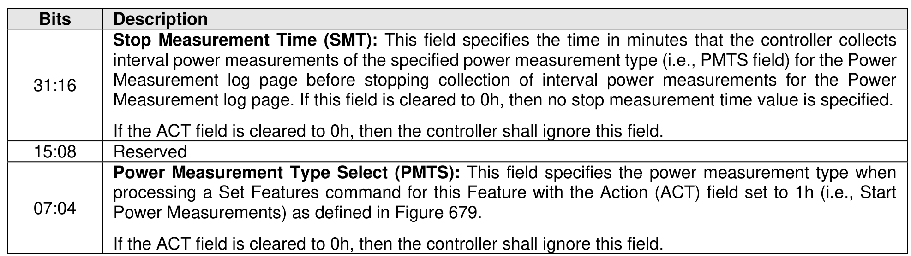
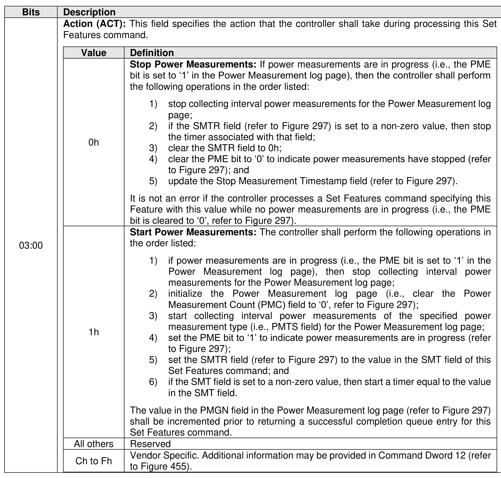
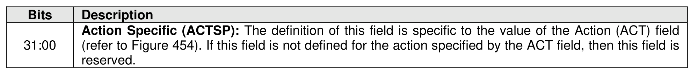
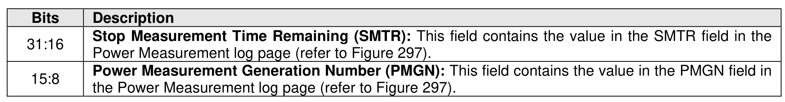
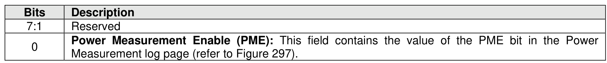

###### 5.2.26.1.27 Power Measurement (Feature Identifier 25h)

> **Section ID**: 5.2.26.1.27 | **Page**: 454-457

This Feature controls operation of the Power Measurement capability (refer to section 8.1.19.1).
If a Set Features command is issued specifying this Feature, then the attributes are specified in Command
Dword 11 (refer to Figure 454) and Command Dword 12 (refer to Figure 455). Completion queue entry
Dword 0 is defined in Figure 456.
If a Get Features command specifying this Feature is successfully completed, then the attributes described
in Figure 456 are returned in Dword 0 of the completion queue entry for that command.
This Feature is not saveable (refer to Figure 199). The default value of this Feature shall be all bytes cleared
to 0h. The current value of this Feature is persistent across power cycles and resets (refer to Figure 403).
The Action field in Command Dword 11 (refer to Figure 454) specifies whether the controller:
a) starts collecting interval power measurements for the Power Measurement log page;
b) stops collecting interval power measurements for the Power Measurement log page; or
c) performs a vendor specific action.
Refer to section 8.1.19.1 for the usage of this Feature by the host.

---
### 📊 Tables (5)

#### Table 1: Untitled Table

| Value | Definition |
| :--- | :--- |
| 0h | **Stop Power Measurements:** If power measurements are in progress (i.e., the PME bit is set to '1' in the Power Measurement log page), then the controller shall perform the following operations in the order listed: 1) stop collecting interval power measurements for the Power Measurement log page; 2) if the SMTR field (refer to Figure 297) is set to a non-zero value, then stop the timer associated with that field; 3) clear the SMTR field to 0h; 4) clear the PME bit to '0' to indicate power measurements have stopped (refer to Figure 297); and 5) update the Stop Measurement Timestamp field (refer to Figure 297). It is not an error if the controller processes a Set Features command specifying this feature with this value while no power measurements are in progress (i.e., the PME bit is cleared to '0', refer to Figure 297). |
| 1h | **Start Power Measurements:** The controller shall perform the following operations in the order listed: 1) if power measurements are in progress (i.e., the PME bit is set to '1' in the Power Measurement log page), then stop collecting interval power measurements for the Power Measurement log page; 2) initialize the Power Measurement log page (i.e., clear the Power Measurement Count (PMC) field to '0', refer to Figure 297); 3) start collecting interval power measurements of the specified power measurement type (i.e., PMTS field) for the Power Measurement log page; 4) set the PME bit to '1' to indicate power measurements are in progress (refer to Figure 297); 5) set the SMTR field (refer to Figure 297) to the value in the SMT field of this Set Features command; and 6) if the SMT field is set to a non-zero value, then start a timer equal to the value in the SMT field. The value in the PMGN field in the Power Measurement log page (refer to Figure 297) shall be incremented prior to returning a successful completion queue entry for this Set Features command. |
| All others | Reserved |
| Ch to Fh | Vendor Specific. Additional information may be provided in Command Dword 12 (refer to Figure 455). |

#### Table 2: Untitled Table

(Continuation of Untitled Table - see first part)

#### Table 3: Untitled Table

(Continuation of Untitled Table - see first part)

#### Table 4: Untitled Table

(Continuation of Untitled Table - see first part)

#### Table 5: Untitled Table

(Continuation of Untitled Table - see first part)

