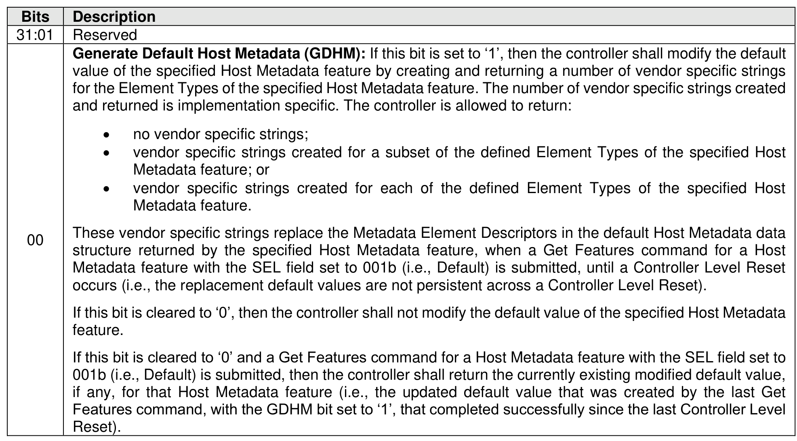
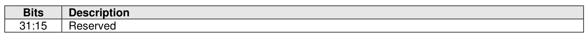
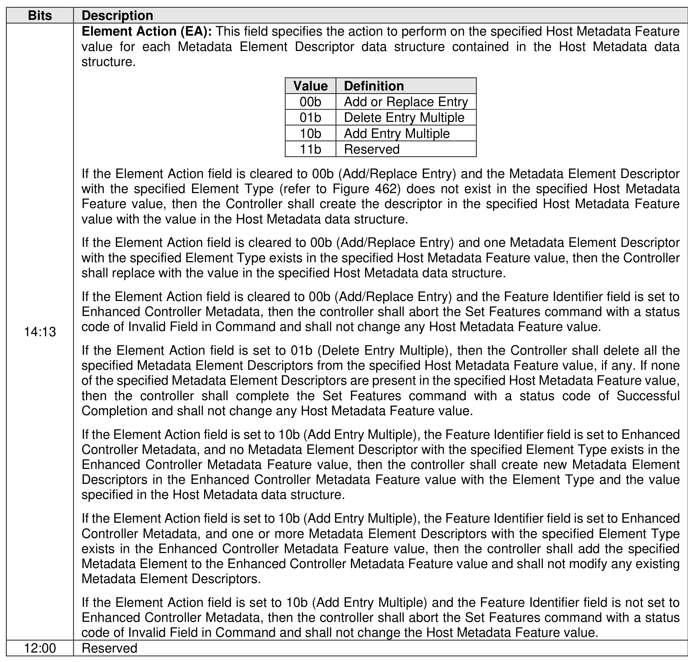
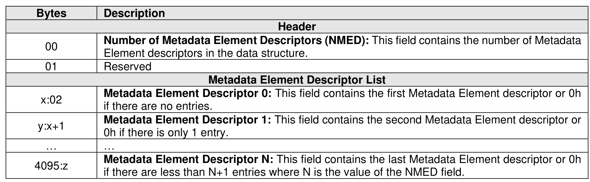
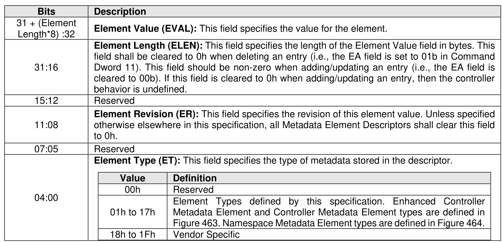

###### 5.2.26.1.30 Host Metadata (Feature Identifier 7Dh), (Feature Identifier 7Eh), (Feature Identifier 7Fh)

> **Section ID**: 5.2.26.1.30 | **Page**: 457-460

The Host Metadata features are the Enhanced Controller Metadata feature (Feature Identifier 7Dh), the
Controller Metadata feature (Feature Identifier 7Eh), and the Namespace Metadata feature (Feature
Identifier 7Fh).
If a Get Features command specifying one of the Host Metadata features with the SEL field set to 011b
(i.e., Supported Capabilities) is submitted, then the Saveable bit in Dword 0 of the corresponding completion
queue entry shall be cleared to ‘0’ (i.e., refer to section 4.4), and the Changeable bit in Dword 0 of the
corresponding completion queue entry shall be set to ‘1’.
If a Get Features command specifying one of the Host Metadata features, the controller shall perform
additional actions specified in Figure 459.
The host issues a Set Features command specifying one of the Host Metadata features containing a Host
Metadata data structure (refer to Figure 461). The host receives a Host Metadata data structure via the Get
Features command. The content of the strings in the Host Metadata data structure are vendor specific.
If any Get Features command specifying the GDHM bit set to ‘1’ returned a status code of Successful
Completion since the last Controller Level Reset, then for any subsequent Get Features command that
specifies a SEL field set to 001b (i.e., Default) and specifies a Host Metadata feature, the controller shall
return the replaced default value containing the most recent vendor specific strings for that Host Metadata
feature.
The Action is specified in Command Dword 11 as shown in Figure 460.
Metadata Element Descriptors may be added, replaced, or deleted based on the action specified in the
Element Action field. Modification of the Host Metadata Feature value shall be performed by the controller
in an atomic manner.
If a Set Features command is submitted for a Host Metadata Feature, a Host Metadata data structure,
defined in Figure 461, is transferred in the data buffer for the command. The Host Metadata data structure
is 4 KiB in size and contains zero or more Metadata Element Descriptors. If the host attempts to add or
replace a Metadata Element that causes the Host Metadata Feature value of the specified feature to grow
larger than 4 KiB, then the controller shall abort the command with a status code of Invalid Field in
Command.
If the host receives a Host Metadata data structure via the Get Features command, then all of the Metadata
Element Descriptors present for the specified feature are added to a Host Metadata data structure (refer to
Figure 461) and returned in the data buffer for that command. The data buffer size is equal to the size of
the Host Metadata data structure that is 4 KiB in size.
If the Feature Identifier field specifies Controller Metadata or Namespace Metadata, then the Host Metadata
data structure may contain at most one Metadata Element Descriptor of each Element Type. If the Feature
Identifier field specifies Enhanced Controller Metadata, then a Host Metadata data structure may contain
more than one Metadata Element Descriptor of each Element Type. Each Metadata Element Descriptor
contains the data structure shown in Figure 462.

---
### 📊 Tables (5)

#### Table 1: Untitled Table

| Value | Definition |
| :--- | :--- |
| 00b | Add or Replace Entry |
| 01b | Delete Entry Multiple |
| 10b | Add Entry Multiple |
| 11b | Reserved |
| | |
| :--- | :--- |
| 0 | Number of Metadata Element Descriptors (NMED): This field contains the number of Metadata Element descriptors in the data structure. |
| 1 | Reserved |
| | **Metadata Element Descriptor List** |
| 02 | **Metadata Element Descriptor 0**: This field contains the first Metadata Element descriptor or 0h if there are no entries. |
| +1 | **Metadata Element Descriptor 1**: This field contains the second Metadata Element descriptor or 0h if there is only 1 entry. |
| .. | .. |
| :z | **Metadata Element Descriptor N**: This field contains the last Metadata Element descriptor or 0h if there are less than N+1 entries where N is the value of the NMED field. |
| | |
| | Feature Identifier field specifies Controller Metadata or Namespace Metadata, then the Host Metadata structure may contain at most one Metadata Element Descriptor of each Element Type. If the Feature Identifier field specifies Enhanced Controller Metadata, then a Host Metadata data structure may contain at most one Metadata Element Descriptor of each Element Type. Each Metadata Element Descriptor in the data structure shown in Figure 462. |
| :12 | Reserved |
| :08 | **Element Revision (ER)**: This field specifies the revision of this element value. Unless specified otherwise elsewhere in this specification, all Metadata Element Descriptors shall clear this field to 0h. |
| :05 | Reserved |
| :00 | **Element Type (ET)**: This field specifies the type of metadata stored in the descriptor. |
| | |

#### Table 2: Untitled Table

(Continuation of Untitled Table - see first part)

#### Table 3: Untitled Table

(Continuation of Untitled Table - see first part)

#### Table 4: Untitled Table

(Continuation of Untitled Table - see first part)

#### Table 5: Untitled Table

(Continuation of Untitled Table - see first part)

