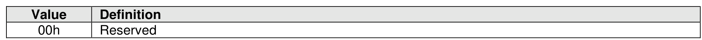
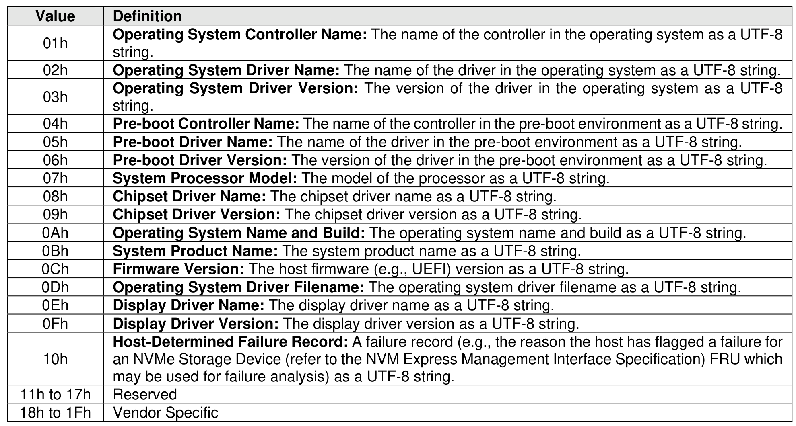

###### 5.2.26.1.30.1  Enhanced Controller Metadata (Feature Identifier 7Dh)

> **Section ID**: 5.2.26.1.30.1 | **Page**: 460-461

This Feature is used to store enhanced controller metadata about the host platform for later retrieval.
The metadata element types defined in Figure 463 are used by this Feature
Refer to section 5.2.26.1.30 for the definitions of Command Dword 11 and the Host Metadata data structure.
The default value for the Number of Metadata Element Descriptors of the Enhanced Controller Metadata
Feature shall be 0h on a Controller Level Reset.
If a Get Features command with the SEL field set to 011b (i.e., Supported Capabilities) with the Enhanced
Controller Metadata Feature value is submitted, then the NS Specific bit in Dword 0 of the corresponding
completion queue entry shall be cleared to ‘0’.

---
### 📊 Tables (2)

#### Table 1: Untitled Table

| | |
|:---|:---|
| | Operating System Driver Name: The name of the driver in the operating system as a UTF-8 string. |
| | Operating System Driver Version: The version of the driver in the operating system as a UTF-8 string. |
| | Pre-boot Controller Name: The name of the controller in the pre-boot environment as a UTF-8 string. |
| | Pre-boot Driver Name: The name of the driver in the pre-boot environment as a UTF-8 string. |
| | Pre-boot Driver Version: The version of the driver in the pre-boot environment as a UTF-8 string. |
| | System Processor Model: The model of the processor as a UTF-8 string. |
| | Chipset Driver Name: The chipset driver name as a UTF-8 string. |
| | Chipset Driver Version: The chipset driver version as a UTF-8 string. |
| | Operating System Name and Build: The operating system name and build as a UTF-8 string. |
| | System Product Name: The system product name as a UTF-8 string. |
| | Firmware Version: The host firmware (e.g., UEFI) version as a UTF-8 string. |
| | Operating System Driver Filename: The operating system driver filename as a UTF-8 string. |
| | Display Driver Name: The display driver name as a UTF-8 string. |
| | Display Driver Version: The display driver version as a UTF-8 string. |
| | Host-Determined Failure Record: A failure record (e.g., the reason the host has flagged a failure for an NVMe Storage Device (refer to the NVM Express Management Interface Specification) FRU which may be used for failure analysis) as a UTF-8 string. |
| 17h | Reserved |
| 1Fh | Vendor Specific |
| | section 5.2.26.1.30 for the definitions of Command Dword 11 and the Host Metadata data structure. |
| | fault value for the Number of Metadata Element Descriptors of the Enhanced Controller Metadata shall be 0h on a Controller Level Reset. |
| | Features command with the SEL field set to 011b (i.e., Supported Capabilities) with the Enhanced |
| | er Metadata Feature value is submitted, then the NS Specific bit in Dword 0 of the corresponding |
| | on queue entry shall be cleared to '0'. |

#### Table 2: Untitled Table

(Continuation of Untitled Table - see first part)

