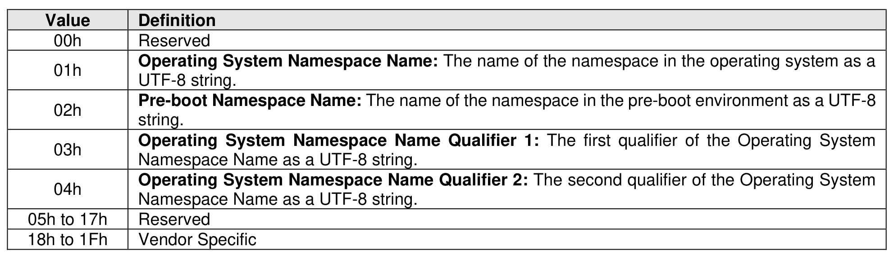

###### 5.2.26.1.30.3 Namespace Metadata (Feature Identifier 7Fh)

> **Section ID**: 5.2.26.1.30.3 | **Page**: 462-462

This Feature is used to store metadata about a namespace associated with a controller for later retrieval.
This Feature is namespace specific and controller specific. The Add Entry Multiple action is prohibited for
this Feature.
Refer to section 5.2.26.1.30 for the definitions of Command Dword 11 and the Host Metadata data structure.
If a Get Features command with the SEL field set to 011b (i.e., Supported Capabilities) with the Namespace
Metadata Feature value is submitted, then the NS Specific bit in Dword 0 of the corresponding completion
queue entry shall be set to ‘1’.
Sanitize operations may affect the values of this Feature as specified in Figure 704.

---
### 📊 Tables (1)

#### Table 1: Untitled Table

| | |
| :--- | :--- |
| | UTF-8 string. |
| | **Pre-boot Namespace Name:** The name of the namespace in the pre-boot environment as a UTF-8 string. |
| | **Operating System Namespace Name Qualifier 1:** The first qualifier of the Operating System Namespace Name as a UTF-8 string. |
| | **Operating System Namespace Name Qualifier 2:** The second qualifier of the Operating System Namespace Name as a UTF-8 string. |
| 17h | Reserved |
| 1Fh | Vendor Specific |

