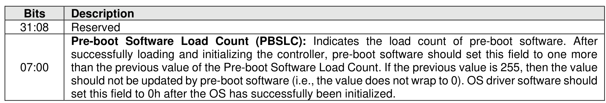

###### 5.2.26.1.31 Software Progress Marker (Feature Identifier 80h)

> **Section ID**: 5.2.26.1.31 | **Page**: 462-462

This Feature is a controller software progress marker. The software progress marker is persistent across
power states. This information may be used to indicate to an OS software driver whether there have been
issues with the OS successfully loading. The attributes are specified in Command Dword 11.
If a Get Features command is submitted for this Feature, the attributes specified in Figure 465 are returned
in Dword 0 of the completion queue entry for that command.

---
### 📊 Tables (1)

#### Table 1: Untitled Table

| | | | | |
|---|---|---|---|---|
| | | | | |
| | | | | |
| | | | | |
| | | | | |
| | | | | |

