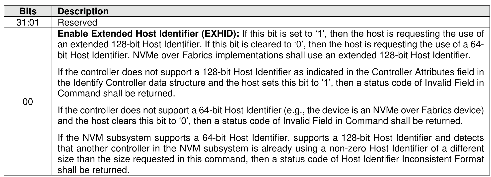
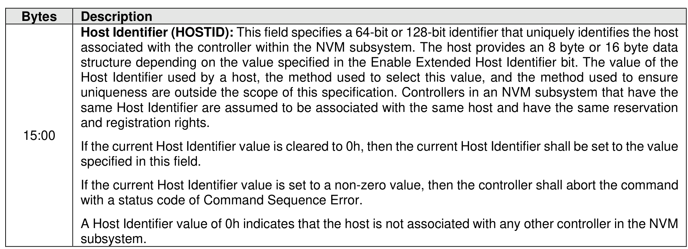

###### 5.2.26.1.32 Host Identifier (Feature Identifier 81h)

> **Section ID**: 5.2.26.1.32 | **Page**: 462-463

This Feature allows the host to register a Host Identifier with the controller. The Host Identifier is used by
the controller to determine whether other controllers in the NVM subsystem are associated with the same
host. The Host Identifier may be used to designate host elements that access an NVM subsystem
independently of each other or for reservations.
The Host Identifier is contained in the data structure indicated in Figure 467. The attributes are specified in
Command Dword 11. If a Get Features command is issued for this Feature, the data structure specified in
Figure 467 is returned in the data buffer for that command.
A Host Identifier value of 0h indicates that the host associated with the controller is not associated with any
other controller in the NVM subsystem. For example, two controllers in an NVM subsystem that both have
a Host Identifier value of 0h indicates that the controllers are associated with different hosts. NVMe over
PCIe implementations may support using a Host Identifier value of 0h for the reservations feature (refer to
section 8.1.24). However, reservations and registrations associated with a Host Identifier value of 0h do not
persist across a Controller Level Reset since a host that uses a Host Identifier value of 0h is treated as a
different host after a Controller Level Reset.
A Set Features command should be used to change a Host Identifier value of 0h to a non-zero value before
using streams (refer to section 8.1.9.3) or using reservations (refer to section 8.1.24). Information (i.e.,
streams or reservations) associated with a Host Identifier value of 0h retain the association to that Host
Identifier if the Host Identifier value is changed and are not associated with the host that has the non-zero
Host Identifier.
The NVM subsystem indicates if reservations are supported with a Host Identifier value of 0h with the RHII
bit in the Controller Attributes field of the Identify Controller data structure (refer to Figure 328). The NVM
subsystem indicates if streams are supported with a Host Identifier value of 0h with the SRNZID bit in the
NVM Subsystem Stream Capability field of the streams directive return parameters (refer to Figure 655).
The Host Identifier feature shall not be a saveable feature.
The requirements and use of the Host Identifier feature are dependent on whether the NVMe over PCIe
implementation or the NVMe over Fabrics implementation is supported. Refer to section 5.2.26.1.32.1 and
section 5.2.26.1.32.2.

---
### 📊 Tables (2)

#### Table 1: Untitled Table

| Description |  |
| :--- | :--- |
| Host Identifier (HOSTID): This field specifies a 64-bit or 128-bit identifier that uniquely identifies the host associated with the controller within the NVM subsystem. The host provides an 8 byte or 16 byte data structure depending on the value specified in the Enable Extended Host Identifier bit. The value of the Host Identifier used by a host, the method used to select this value, and the method used to ensure uniqueness are outside the scope of this specification. Controllers in an NVM subsystem that have the same Host Identifier are assumed to be associated with the same host and have the same reservation and registration rights. |  |
| If the current Host Identifier value is cleared to 0h, then the current Host Identifier shall be set to the value with a status code of Command Sequence Error. |  |
| A Host Identifier value of 0h indicates that the host is not associated with any other controller in the NVM subsystem. |  |

#### Table 2: Untitled Table

(Continuation of Untitled Table - see first part)

