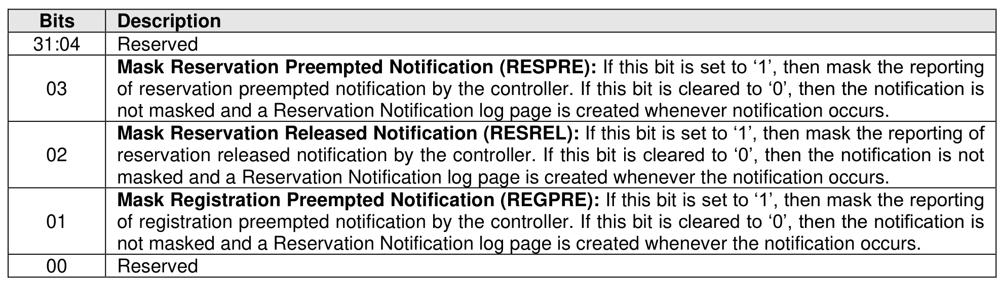

###### 5.2.26.1.33 Reservation Notification Mask (Feature Identifier 82h)

> **Section ID**: 5.2.26.1.33 | **Page**: 464-464

This Feature controls the masking of reservation notifications on a per namespace basis. A Reservation
Notification log page is created whenever a reservation notification occurs on a namespace and the
corresponding reservation notification type is not masked on that namespace by this Feature. If reservations
are supported by the controller, then this Feature shall be supported. The attributes are specified in
Command Dword 11.
A Set Features command that uses a namespace ID other than FFFFFFFFh modifies the reservation
notification mask for the corresponding namespace only. A Set Features command that uses a namespace
ID of FFFFFFFFh modifies the reservation notification mask of all namespaces that are attached to the
controller and that support reservations. A Get Features command that uses a namespace ID other than
FFFFFFFFh returns the reservation notification mask for the corresponding namespace. A Get Features
command that uses a namespace ID of FFFFFFFFh shall be aborted with status code of Invalid Field in
Command. If a Set Features command or a Get Features command attempts to access the Reservation
Notification Mask on a namespace that does not support reservations or is invalid, then that command is
aborted with status code of Invalid Field in Command.
If a Get Features command successfully completes for this Feature, the attributes specified in Figure 468
are returned in Dword 0 of the completion queue entry for that command.

---
### 📊 Tables (1)

#### Table 1: Untitled Table

| 34 Reservation Persistence (Feature Identifier 83h) |
| --- |
| mspace that supports reservations has a Persist Through Power Loss (PTPL) state that may be |
| using either a Set Features command or a Reservation Register command (refer to section 7.6). |
| ervation Persistence feature attributes are specified in Command Dword 11. |
| PL state is contained in the Reservation Persistence feature that is namespace specific. A Set |
| s command that uses the namespace ID FFFFFFFFh modifies the PTPL state associated with all |

