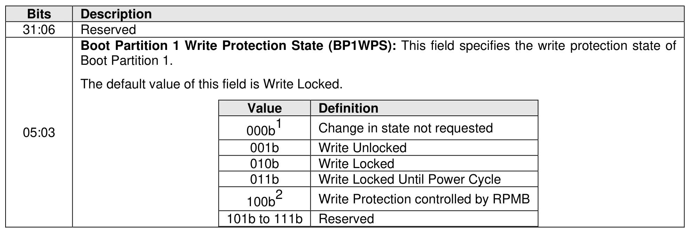
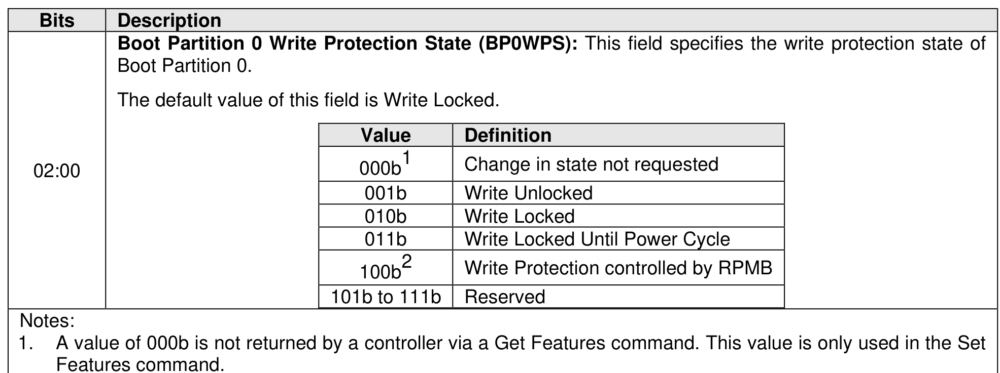

###### 5.2.26.1.36 Boot Partition Write Protection Config (Feature Identifier 85h)

> **Section ID**: 5.2.26.1.36 | **Page**: 466-467

This Feature is used by the host to configure Boot Partition write protection states and to determine the
write protection state of both Boot Partitions supported by a controller. Refer to section 8.1.3.3.1 for
definition and behaviors of the Boot Partition write protection states and state transitions. The settings are
specified in Command Dword 11.
This Feature is not saveable (refer to Figure 199). The default value of both the Boot Partition 0 Write
Protection State field and the Boot Partition 1 Write Protection State field after a power cycle is Write
Locked.
If a Get Features command is submitted for this Feature, the attributes specified in Figure 471 are returned
in Dword 0 of the completion queue entry for that command. A controller shall not return a value of 000b
for either the Boot Partition 0 Write Protection State field or the Boot Partition 1 Write Protection State field
as a result of the Get Features command for the Boot Partition Write Protection Config feature.
If a Set Features command is submitted for this Feature with either the Boot Partition 0 Write Protection
State field or the Boot Partition 1 Write Protection State field cleared to 000b, then the controller shall not
change the Boot Partition write protection state for that Boot Partition as part of the Set Features command
completion.
If the Boot Partition Write Protection Enable bit is set to ‘1’ in the RPMB Device Configuration Block data
structure (refer to section 8.1.23), then the controller shall return a value of 100b for both the Boot Partition
0 Write Protection State field and the Boot Partition 1 Write Protection State field as a result of the Get
Features command for the Boot Partition Write Protection Config feature.
If a Set Features command is submitted for this Feature with either the Boot Partition 0 Write Protection
State field or the Boot Partition 1 Write Protection State field set to 100b, then the controller shall abort the
command with a status code of Invalid Field in Command.
If a Set Features command is submitted that attempts to change the Boot Partition write protection state of
a Boot Partition that is in the Write Locked Until Power Cycle state, then the controller shall abort the
command with a status code of Feature Not Changeable.
If a Set Features command is submitted that attempts to change either Boot Partition write protection state
from a value of 100b (i.e., Boot Partition write protection is controlled by RPMB), then the controller shall
abort the command with a status code of Feature Not Changeable.
If a Set Features command attempts to change the Boot Partition write protection state of a Boot Partition
shared across multiple controllers to the Write Locked Until Power cycle state in a multi-domain NVM
subsystem (i.e., the MDS bit is set to ‘1’ in the CTRATT field of the Identify Controller data structure (refer
to Figure 328), then the controller shall abort the command with a status code of Feature Not Changeable.

---
### 📊 Tables (2)

#### Table 1: Untitled Table

| Value | Definition |
|:---|:---|
| 000b¹ | Change in state not requested |
| 001b | Write Unlocked |
| 010b | Write Locked |
| 011b | Write Locked Until Power Cycle |
| 100b² | Write Protection controlled by RPMB |
| 101b to 111b | Reserved |

#### Table 2: Untitled Table

(Continuation of Untitled Table - see first part)

