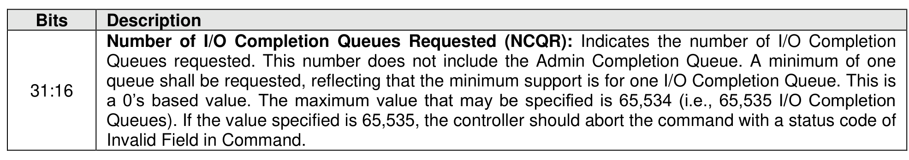
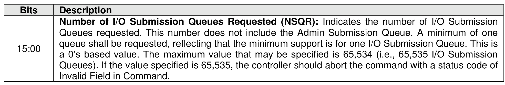
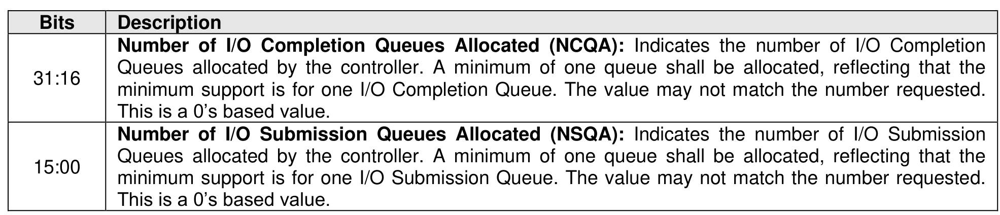

###### 5.2.26.2.1 Number of Queues (Feature Identifier 07h)

> **Section ID**: 5.2.26.2.1 | **Page**: 467-468

This Feature indicates the number of queues that the host requests for the controller processing the
command. This Feature shall only be issued during initialization prior to creation of any I/O Submission
and/or Completion Queues. If a Set Features command is issued for this Feature after creation of any I/O
Submission and/or I/O Completion Queues, then the Set Features command shall abort with status code
of Command Sequence Error. The controller shall not change the value allocated between resets. For a
Set Features command, the attributes are specified in Command Dword 11 (refer to Figure 472). For a Get
Features command, Dword 11 is ignored.
If a Set Features or Get Features command is submitted for this Feature, the attributes specified in Figure
473 are returned in Dword 0 of the completion queue entry for that command.
Note: The value allocated may be smaller or larger than the number of queues requested, often in virtualized
implementations. The controller may not have as many queues to allocate as are requested. Alternatively,
the controller may have an allocation unit of queues (e.g., power of two) and may supply more queues to
the host to satisfy its allocation unit.

---
### 📊 Tables (3)

#### Table 1: Untitled Table

| | |
| :--- | :--- |
| Queues requested. This number does not include the Admin Submission Queue. A minimum of one queue shall be requested, reflecting that the minimum support is for one I/O Submission Queue. This is a 0's based value. The maximum value that may be specified is 65,534 (i.e., 65,535 I/O Submission Queues). If the value specified is 65,535, the controller should abort the command with a status code of Invalid Field in Command. | |
| The value allocated may be smaller or larger than the number of queues requested, often in virtualized environments. The controller may not have as many queues to allocate as are requested. Alternatively, the controller may have an allocation unit of queues (e.g., power of two) and may supply more queues to satisfy its allocation unit. | |
| Queues allocated by the controller. A minimum of one queue shall be allocated, reflecting that the minimum support is for one I/O Submission Queue. The value may not match the number requested. This is a 0's based value. | |
| **2.2 Interrupt Coalescing (Feature Identifier 08h)** | |
| This feature configures controller interrupt coalescing settings. The controller should signal an interrupt when either the Aggregation Time or the Aggregation Threshold conditions are met. If either the Aggregation Time or the Aggregation Threshold fields are cleared to 0h, then an interrupt may be generated (i.e., interrupt coalescing is implicitly disabled). This Feature applies only to the I/O Queues. It is intended that interrupts for commands that complete in error are not coalesced. The settings are defined in Command Dword 11. | |

#### Table 2: Untitled Table

(Continuation of Untitled Table - see first part)

#### Table 3: Untitled Table

(Continuation of Untitled Table - see first part)

