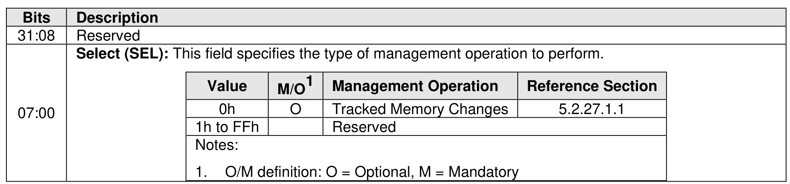
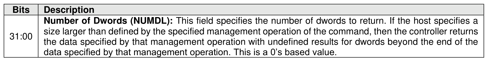

#### 5.2.27 Track Receive command

> **Section ID**: 5.2.27 | **Page**: 473-474

The Track Receive command is used to obtain the information being tracked by the controller that was
enabled by a Track Send command (refer to section 5.2.28).
The Track Receive command uses the Data Pointer field, Command Dword 10 field, and Command Dword
12 field. The use of the Command Dword 11 field is specific to the management operation specified by the
Select field. All other command specific fields are reserved.
The Select field defined in Figure 486 specifies the management operation to be performed. Refer to section
5.2.27.1 for a description of each management operation.

---
### 📊 Tables (2)

#### Table 1: Untitled Table

| 449 |
| :--- |
| size larger than defined by the specified management operation of the command, then the controller returns the data specified by that management operation with undefined results for dwords beyond the end of the data specified by that management operation. This is a 0's based value. |
| **Track Receive Management Operations** |
| 1.1 Tracked Memory Changes (Management Operation 0h) |

#### Table 2: Untitled Table

(Continuation of Untitled Table - see first part)

