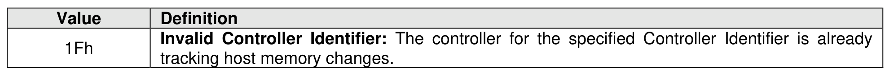

###### 5.2.27.1.2 Command Completion

> **Section ID**: 5.2.27.1.2 | **Page**: 476-476

Upon completion of the Track Receive command, the controller posts a completion queue entry to the
Admin Completion Queue indicating the status for the command. Section 5.2.27.1 describes completion
details each for management operation.
Track Receive command specific status values (i.e., SCT field set to 1h) are shown in Figure 491.

---
### 📊 Tables (1)

#### Table 1: Untitled Table

| Field | Description |
| :--- | :--- |
| Command | 0x01 |
| Version | 0x01 |
| Reserved | 0x00 |
| Data Pointer | 0x00000000 |
| Data Length | 0x00000000 |
| Track ID | 0x00000000 |
| Track Type | 0x00 |
| Reserved | 0x00 |
| Track Data | 0x0000000000000000000000000000000

