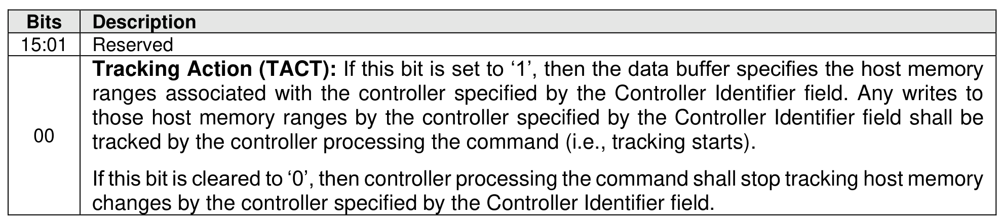
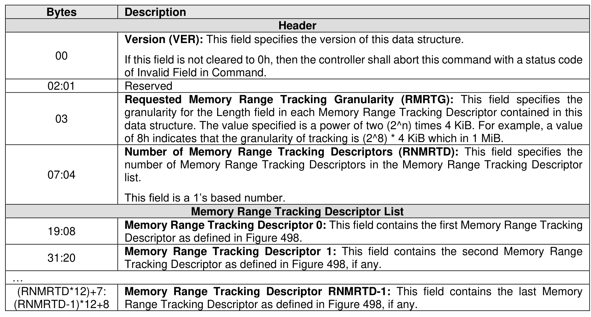
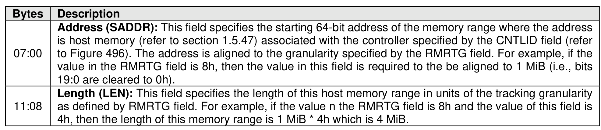
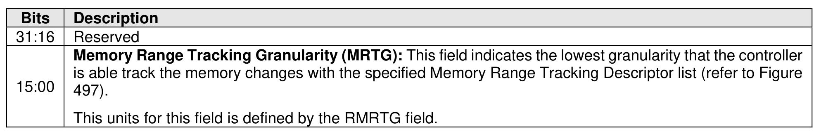
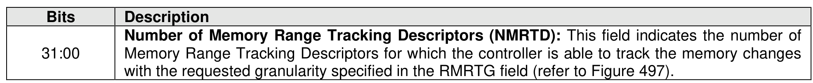

###### 5.2.28.1.2 Track Memory Changes (Management Operation 1h)

> **Section ID**: 5.2.28.1.2 | **Page**: 477-480

The Track Memory Changes management operation of the Track Send command requests the controller
processing that Track Send command to:
•
start tracking host memory changes described by the specified host memory ranges that are
caused by the processing commands in the controller specified by Controller Identifier field (refer
to Figure 496); or
•
stop tracking the host memory changes that are caused by the processing commands by the
controller specified by Controller Identifier field.
If the TACT bit is set to ‘1’ (refer to Figure 495), then:
•
The data buffer contains a Track Memory Changes data structure (refer to Figure 497) that
specifies one or more host memory ranges associated with the controller specified by the
Controller Identifier field.
•
If the value in the Requested Memory Range Tracking Granularity (RMRTG) field is greater than
the value in the Maximum Memory Range Tracking Granularity (MAXMRTG) field in the Identify
Controller data structure (refer to Figure 328), then the controller shall abort the command with a
status code of Invalid Field in Command.
•
If the value in the Requested Memory Range Tracking Granularity (RMRTG) field is less than the
value in the Minimum Memory Range Granularity (MINMRG) field in the Identify Controller data
structure (refer to Figure 328), then the controller shall abort the command with a status code of
Invalid Field in Command.
•
If the sum of:
o
the value in the Requested Number of Memory Range Tracking Descriptors (RNMRTD)
field; and
o
the number of Memory Range Tracking Descriptors currently being tracked by the
controller processing the command for other controllers in the NVM subsystem,
is greater than the value in the Controller Maximum Memory Range Tracking Descriptors
(CMMRTD) field in the Identify Controller data structure (refer to Figure 328), then the controller
processing the command shall abort the command with a status code of Invalid Field in Command.
p
g
•
If the sum of the value in the Requested Number of Memory Range Tracking Descriptors
(RNMRTD) field plus the number of Memory Range Tracking Descriptors currently being tracked
by all controllers in the NVM subsystem is greater than the value in the NVM subsystem Maximum
Memory Range Tracking Descriptors (NMMRTD) field in the Identify Controller data structure (refer
to Figure 328), then the controller shall abort the command with a status code of Invalid Field in
Command.
•
If any controller in the NVM subsystem is already tracking host memory changes for the controller
specified by the CNTLID field, then the controller processing the command shall abort the
command with a status code of Invalid Controller Identifier.
•
o
the Memory Range Tracking Length Limit (MRTLL) bit in the Identify Controller data
structure is set to ‘1’; and
o
the length as specified by the Requested Memory Range Tracking Granularity field and
any Length field in a Track Memory Changes data structure is not a value that is a power
of 2,
then the controller shall abort the command with a status code of Invalid Field in Command.
If the TACT bit is cleared to ‘0’, then the data buffer shall be ignored by the controller.
If the controller specified by the CNTLID field is suspended (refer to section 5.2.17.1.1), then the controller
shall abort the command with a status code of Controller Suspended.
Figure 498 defines a Memory Range Tracking Descriptor. The address range specified by a Memory Range
Tracking Descriptor describes addresses specified in an SGL or PRP for a command submitted by a host
to the controller specified in the CNTLID field (refer to Figure 496).
If the controller is unable to track the requested number of Memory Range Tracking Descriptors (i.e.,
specified in the RNMRTD field) or unable to track the memory changes at the specified granularity (i.e.,
RMRTG field), then:
•
the controller shall abort the command with a status code of Not Enough Resources; and
•
Dword 0 and Dword 1 of the completion queue entry shall be returned as defined in Figure 499
and Figure 500.
If any Address field is not aligned to the granularity specified by the RMRTG field, then the controller shall
abort the command with a status code of Invalid Field in Command.
If the address range specified by the Address field and the Length field specifies an address that is not host
memory (refer to section 1.5.47) associated with the controller specified by the CNTLID field, then the
controller processing the command shall abort the command with a status code of Invalid Field in
Command. If:
•
the command is successful; and
•
the configuration within the controller associated with the controller specified by the CNTLID field
changes resulting in that address range is no longer specifying host memory associated with the
controller specified by the CNTLID field (e.g., the address range overlaps with PMR or CMB), then
the behavior for tracking host memory changes for the controller specified by the CNTLID field is
undefined.
A host should not specify MSI or MSI-X registers in the address range. If the address range specified by
the Address field and the Length field contains addresses for MSI or MSI-X registers on the controller
specified by the CNTLID field, then the controller may or may not report modification to those MSI or MSI-
X register addresses.

---
### 📊 Tables (6)

#### Table 1: Untitled Table

| | Description |
|:---|:---|
| | **Controller Identifier (CNTLID):** This field specifies the identifier of the controller for which changes to host memory is being tracked. If the value of this field is the controller identifier of the controller processing the command, then the controller processing the command shall abort the command with a status code of Invalid Controller Identifier. |
| | If the controller specified by the CNTLID field is suspended (refer to section 5.2.17.1.1), then the controller shall abort the command with a status code of Controller Suspended. |
| | |
| 00 | **Version (VER):** This field specifies the version of this data structure.   If this field is not cleared to 0h, then the controller shall abort this command with a status code of Invalid Field in Command. |
| 02:01 | Reserved |
| 03 | **Requested Memory Range Tracking Granularity (RMR TG):** This field specifies the granularity for the Length field in each Memory Range Tracking Descriptor contained in this data structure. The value specified is a power of two (2^n) times 4 KiB. For example, a value of 8h indicates that the granularity of tracking is (2^8) * 4 KiB which in 1 MiB. |
| 07:04 | **Number of Memory Range Tracking Descriptors (RNMRTD):** This field specifies the number of Memory Range Tracking Descriptors in the Memory Range Tracking Descriptor list.   This field is a 1's based number. |
| | **Memory Range Tracking Descriptor List** |
| 9:08 | **Memory Range Tracking Descriptor 0:** This field contains the first Memory Range Tracking Descriptor as defined in Figure 498. |
| 31:20 | **Memory Range Tracking Descriptor 1:** This field contains the second Memory Range Tracking Descriptor as defined in Figure 498, if any. |
| (RMR TD*12)+7: (RMR TD-1)*12+8 | **Memory Range Tracking Descriptor RNMRTD-1:** This field contains the last Memory Range Tracking Descriptor as defined in Figure 498, if any. |
| | Figure 498 defines a Memory Range Tracking Descriptor. The address range specified by a Memory Range Tracking Descriptor describes addresses specified in an SGL or PRP for a command submitted by a host controller specified in the CNTLID field (refer to Figure 496). |
| | **Figure 498: Memory Range Tracking Descriptor** |
| | **Description** |
| | **Address (SADDR):** This field specifies the starting 64-bit address of the memory range where the address controller is unable to track the requested number of Memory Range Tracking Descriptors (i.e., as defined in the RNMRTD field) or unable to track the memory changes at the specified granularity (i.e., as defined in the RMR TG field), then:   the controller shall abort the command with a status code of Not Enough Resources; and   Dword 0 and Dword 1 of the completion queue entry shall be returned as defined in Figure 499 and Figure 500. |
| | If the Address field is not aligned to the granularity specified by the RMR TG field, then the controller shall abort the command with a status code of Invalid Field in Command. |
| | If the address range specified by the Address field and the Length field specifies an address that is not host memory (refer to section 1.5.47) associated with the controller specified by the CNTLID field, then the controller shall abort the command with a status code of Invalid Field in Command. |
| | This units for this field is defined by the RMR TG field. |
| | **Figure 500: Track Memory Changes – Completion Queue Entry Dword 1** |
| | |
| 0 | **Number of Memory Range Tracking Descriptors (NMRTD):** This field indicates the number of Memory Range Tracking Descriptors for which the controller is able to track the memory changes with the requested granularity specified in the RMR TG field (refer to Figure 497). |
| | On completion of the Track Send command, the controller posts a completion queue entry to the Admin Completion Queue indicating the status for the command. Section 5.2.28.1 describes completion details for management operation. |
| | The contents of Dword 0 and Dword 1 of the completion queue entry is specific to the management operation selected in the Select field (refer to Figure 492). Refer to each management operation description in section 5.2.28 for details. |

#### Table 2: Untitled Table

(Continuation of Untitled Table - see first part)

#### Table 3: Untitled Table

(Continuation of Untitled Table - see first part)

#### Table 4: Untitled Table

(Continuation of Untitled Table - see first part)

#### Table 5: Untitled Table

(Continuation of Untitled Table - see first part)

#### Table 6: Untitled Table

(Continuation of Untitled Table - see first part)

