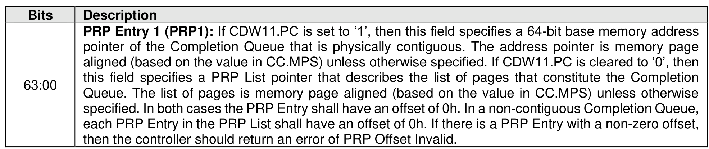
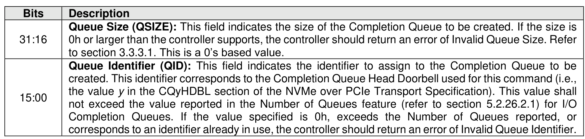
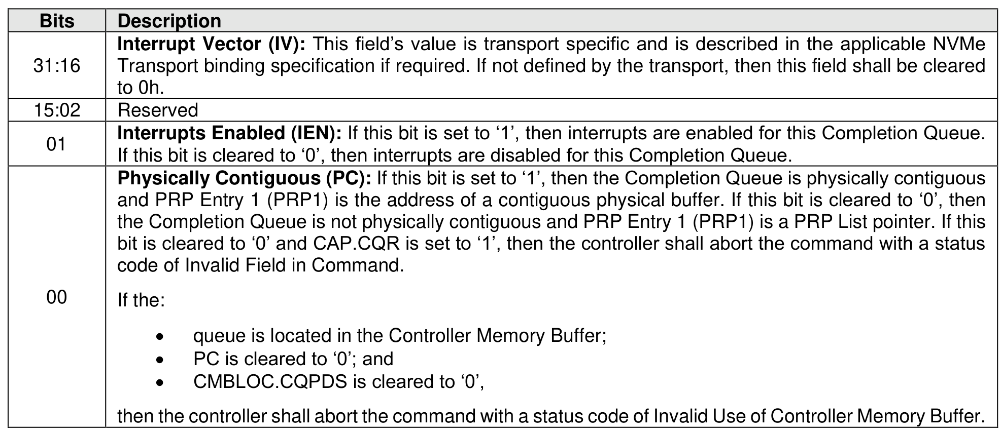

#### 5.3.1 Create I/O Completion Queue command

> **Section ID**: 5.3.1 | **Page**: 481-481

The Create I/O Completion Queue command is used to create all I/O Completion Queues with the exception
of the Admin Completion Queue. The Admin Completion Queue is created by specifying its base address
in the ACQ property. If a PRP List is provided to describe the CQ, then the PRP List shall be maintained by
the host at the same location in host physical memory and the values in the PRP List shall not be modified
until the corresponding Delete I/O Completion Queue command for this CQ is completed successfully or
the controller is reset. If the PRP List values are modified, the behavior is undefined.
The Create I/O Completion Queue command uses the PRP Entry 1, Command Dword 10, and Command
Dword 11 fields. All other command specific fields are reserved.

---
### 📊 Tables (3)

#### Table 1: Untitled Table

| Description | |
| :--- | :--- |
| Queue Size (QSIZE): This field indicates the size of the Completion Queue to be created. If the size is 0h or larger than the controller supports, the controller should return an error of Invalid Queue Size. Refer to section 3.3.3.1. This is a 0's based value. | |
| Queue Identifier (QID): This field indicates the identifier to assign to the Completion Queue to be Completion Queues. If the value specified is 0h, exceeds the Number of Queues reported, or corresponds to an identifier already in use, the controller should return an error of Invalid Queue Identifier. | |
| Description | |
| Interrupt Vector (IV): This field's value is transport specific and is described in the applicable NVMe Transport binding specification if required. If not defined by the transport, then this field shall be cleared to 0h. | |
| Reserved | |
| Interrupts Enabled (IEN): If this bit is set to '1', then interrupts are enabled for this Completion Queue. If this bit is cleared to '0', then interrupts are disabled for this Completion Queue. | |
| Physically Contiguous (PC): If this bit is set to '1', then the Completion Queue is physically contiguous | |
| If the:   • queue is located in the Controller Memory Buffer;   • PC is cleared to '0'; and   • CMBLOC.CQPDS is cleared to '0', | |
| then the controller shall abort the command with a status code of Invalid Use of Controller Memory Buffer. | |

#### Table 2: Untitled Table

(Continuation of Untitled Table - see first part)

#### Table 3: Untitled Table

(Continuation of Untitled Table - see first part)

