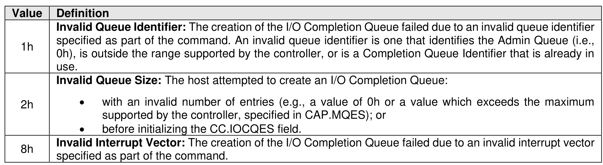

##### 5.3.1.1 Command Completion

> **Section ID**: 5.3.1.1 | **Page**: 482-482

If the command is completed, then the controller shall post a completion queue entry to the Admin
Completion Queue indicating the status for the command.
Create I/O Completion Queue command specific status values are defined in Figure 505.

---
### 📊 Tables (1)

#### Table 1: Untitled Table

| | |
| :--- | :--- |
| **Invalid Queue Size:** The host attempted to create an I/O Completion Queue: | |
| | • with an invalid number of entries (e.g., a value of 0h or a value which exceeds the maximum supported by the controller, specified in CAP.MQES); or |
| | • before initializing the CC.IOCQES field. |
| **Invalid Interrupt Vector:** The creation of the I/O Completion Queue failed due to an invalid interrupt vector specified as part of the command. | |

