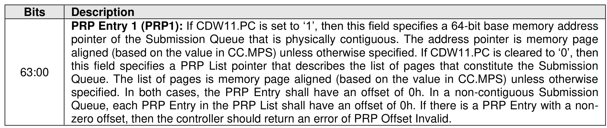
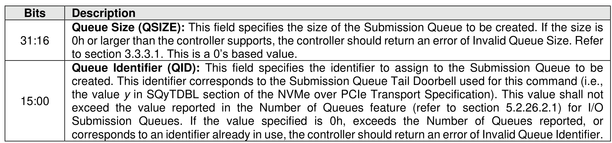
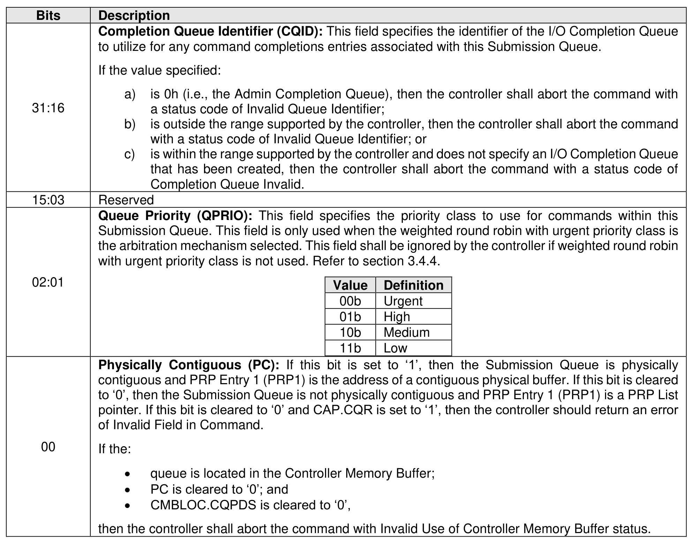
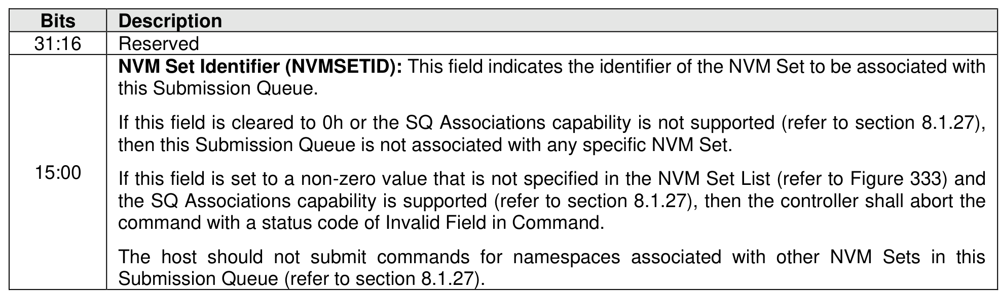

#### 5.3.2 Create I/O Submission Queue command

> **Section ID**: 5.3.2 | **Page**: 482-483

The Create I/O Submission Queue command is used to create I/O Submission Queues. The Admin
Submission Queue is created by specifying its base address in the ASQ property. If a PRP List is provided
to describe the SQ to be created, then the PRP List shall be maintained by a host at the same location in
host physical memory and the values in the PRP List shall not be modified until the corresponding Delete
I/O Submission Queue command for that SQ is completed or the controller is reset. If the PRP List values
are modified, the behavior is undefined.
The Create I/O Submission Queue command uses the PRP Entry 1, Command Dword 10, Command
Dword 11, and Command Dword 12 fields. All other command specific fields are reserved.

---
### 📊 Tables (4)

#### Table 1: Untitled Table

| Description |  |
| :--- | :--- |
| Queue Size (QSIZE): | This field specifies the size of the Submission Queue to be created. If the size is 0h or larger than the controller supports, the controller should return an error of Invalid Queue Size. Refer to section 3.3.3.1. This is a 0's based value. |
| Queue Identifier (QID): | This field specifies the identifier to assign to the Submission Queue to be created. This identifier corresponds to the Submission Queue Tail Doorbell used for this command (i.e., the value y in SQyTDBL section of the NVMe over PCIe Transport Specification). This value shall not exceed the value reported in the Number of Queues feature (refer to section 5.2.26.2.1) for I/O Submission Queues. If the value specified is 0h, exceeds the Number of Queues reported, or corresponds to an identifier already in use, the controller should return an error of Invalid Queue Identifier. |
| | Completion Queue Identifier (CQID): This field specifies the identifier of the I/O Completion Queue to utilize for any command completions entries associated with this Submission Queue. |
| | If the value specified: |
| | a) is 0h (i.e., the Admin Completion Queue), then the controller shall abort the command with a status code of Invalid Queue Identifier; |
| | b) is outside the range supported by the controller, then the controller shall abort the command with a status code of Invalid Queue Identifier; or |
| | c) is within the range supported by the controller and does not specify an I/O Completion Queue that has been created, then the controller shall abort the command with a status code of Completion Queue Invalid. |
| | |
| | |
| | |
| | |
| | |
| | |
| | |
| | |
| | |
| | |

#### Table 2: Untitled Table

(Continuation of Untitled Table - see first part)

#### Table 3: Untitled Table

(Continuation of Untitled Table - see first part)

#### Table 4: Untitled Table

(Continuation of Untitled Table - see first part)

