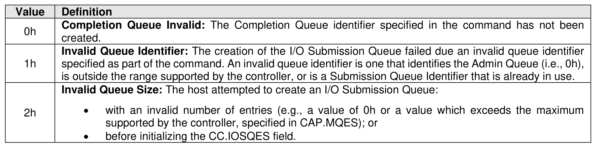

##### 5.3.2.1 Command Completion

> **Section ID**: 5.3.2.1 | **Page**: 483-484

Upon completion of the Create I/O Submission Queue command, the controller posts a completion queue
entry to the Admin Completion Queue.
Create I/O Submission Queue command specific status values are defined in Figure 510.

---
### 📊 Tables (1)

#### Table 1: Untitled Table

| | |
| :--- | :--- |
| **Invalid Queue Identifier:** The creation of the I/O Submission Queue failed due to an invalid queue identifier specified as part of the command. An invalid queue identifier is one that identifies the Admin Queue (i.e., 0h), is outside the range supported by the controller, or is a Submission Queue Identifier that is already in use. | |
| **Invalid Queue Size:** The host attempted to create an I/O Submission Queue: | |
| | • with an invalid number of entries (e.g., a value of 0h or a value which exceeds the maximum supported by the controller, specified in CAP.MQES); or |
| | • before initializing the CC.IOSQES field. |
| | |

