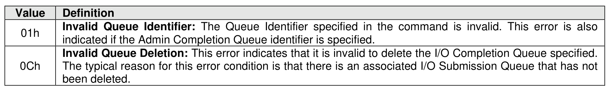

##### 5.3.3.1 Command Completion

> **Section ID**: 5.3.3.1 | **Page**: 484-484

Upon completion of the Delete I/O command, the controller posts a completion queue entry to the Admin
Completion Queue. Delete I/O Completion Queue command specific status values are defined in Figure
512.

---
### 📊 Tables (1)

#### Table 1: Untitled Table

| | |
|---|---|
| | ted by the host. |
| | ccessful completion of the Delete I/O Submission Queue command, all I/O commands previously |
| | d to the indicated Submission Queue shall be either explicitly completed or implicitly completed. |
| | returning a completion queue entry for the Delete I/O Submission Queue command, other |
| | ds previously submitted to the I/O Submission Queue to be deleted may be completed with |
| | ate status (e.g., Successful Completion, Command Aborted due to SQ Deletion). After successful |

