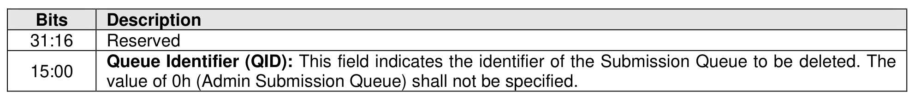

#### 5.3.4 Delete I/O Submission Queue command

> **Section ID**: 5.3.4 | **Page**: 484-485

The Delete I/O Submission Queue command is used to delete an I/O Submission Queue. The Delete I/O
Submission Queue command uses the Command Dword 10 field. All other command specific fields are
reserved. After this command has completed, the PRP List that describes the Submission Queue may be
deallocated by the host.
Upon successful completion of the Delete I/O Submission Queue command, all I/O commands previously
submitted to the indicated Submission Queue shall be either explicitly completed or implicitly completed.
Prior to returning a completion queue entry for the Delete I/O Submission Queue command, other
commands previously submitted to the I/O Submission Queue to be deleted may be completed with
appropriate status (e.g., Successful Completion, Command Aborted due to SQ Deletion). After successful
completion of the Delete I/O Submission Queue command, the controller shall not post completion status
for any I/O commands that were submitted to the deleted I/O Submission Queue. The successful
completion of the Delete I/O Submission Queue command indicates an implicit completion status of
Command Aborted due to SQ Deletion for any previously submitted I/O commands that did not have a
completion queue entry posted by the controller.
Note: It is not possible to delete the Admin Submission Queue.

---
### 📊 Tables (1)

#### Table 1: Untitled Table

| Command Completion |
|---|
| commands submitted to the indicated I/O Submission Queue are either completed or aborted, a on queue entry is posted to the Admin Completion Queue when the queue has been deleted. O Submission Queue command specific status values are defined in Figure 514. |

