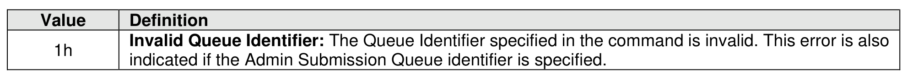

##### 5.3.4.1 Command Completion

> **Section ID**: 5.3.4.1 | **Page**: 485-485

After all commands submitted to the indicated I/O Submission Queue are either completed or aborted, a
completion queue entry is posted to the Admin Completion Queue when the queue has been deleted.
Delete I/O Submission Queue command specific status values are defined in Figure 514.

---
### 📊 Tables (1)

#### Table 1: Untitled Table

| | | | |
| :--- | :--- | :--- | :--- |
| | | | |
| | | | |
| | | | |
| | | | |
| | | | |
| | | | |

