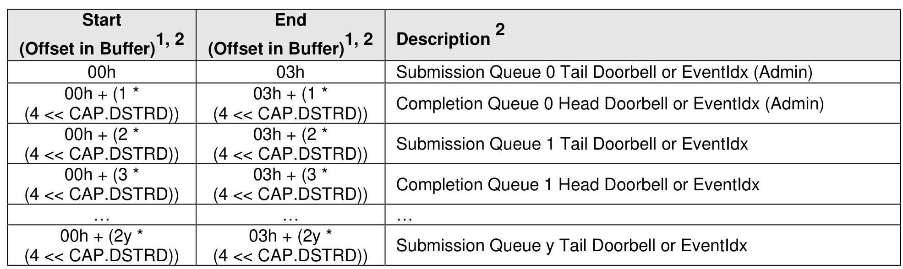
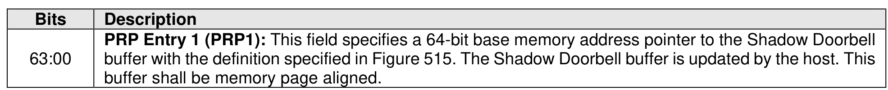
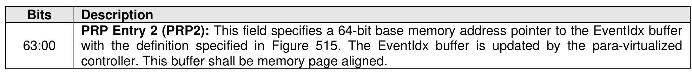

#### 5.3.5 Doorbell Buffer Config command

> **Section ID**: 5.3.5 | **Page**: 485-486

The Doorbell Buffer Config command is used to provide two separate memory buffers that mirror the
controller's doorbell properties defined in section 3.1.4. This command is intended for emulated controllers
and is not typically supported by a physical NVMe controller. The two buffers are known as “Shadow
Doorbell” and “EventIdx”, respectively. Refer to “Updating Controller Doorbell Properties using a Shadow
Doorbell Buffer” in section B.5.2 for an example of how these buffers may be used.
The Doorbell Buffer Config command uses the PRP Entry 1 and PRP Entry 2 fields. All other command
specific fields are reserved. The command is not namespace specific, does not support metadata, and does
not support SGLs. The settings are not retained across a Controller Level Reset.
Each buffer supplied with the Doorbell Buffer Config command shall be a single physical memory page as
defined by the CC.MPS field. The controller shall ensure that the following condition is satisfied:

---
### 📊 Tables (4)

#### Table 1: Untitled Table

| | (Offset in Buffer) | |
|---|---|---|
| | | |
| - ((2y + 1) * | 03h + ((2y + 1) * | Completion Queue y Head Doorbell or EventIdx |
| CAP.DSTRD)) | (4 << CAP.DSTRD)) | |
| | | |
| offsets in Start and End are referenced to the value provided in PRP1 for the doorbell buffer and to the | | |
| e provided in PRP2 for the EventIdx buffer. | | |
| value of y is equal to max(NSQA, NCQA). | | |
| | | |
| Figure 516: Doorbell Buffer Config – PRP Entry 1 | | |
| | | |
| Description | | |
| DDD Entry 1 (DDD1): This field specifies a 64 bit base memory address pointer to the Shadow Doorbell | | |
| | | |
| Figure 517: Doorbell Buffer Config – PRP Entry 2 | | |
| | | |
| Description | | |
| PRP Entry 2 (PRP2): This field specifies a 64-bit base memory address pointer to the EventIdx buffer | | |
| with the definition specified in Figure 515. The EventIdx buffer is updated by the para-virtualized | | |
| e command is completed, the controller posts a completion queue entry to the Aamin Completion | | |
| indicating the status for the command. If the Shadow Doorbell buffer or EventIdx buffer memory | | |
| es are invalid, then a status code of Invalid Field in Command shall be returned. | | |
| | | |
| Virtualization Management command | | |
| | | |
| alization Management command is supported by primary controllers that support the Virtualization | | |

#### Table 2: Untitled Table

(Continuation of Untitled Table - see first part)

#### Table 3: Untitled Table

(Continuation of Untitled Table - see first part)

#### Table 4: Untitled Table

(Continuation of Untitled Table - see first part)

