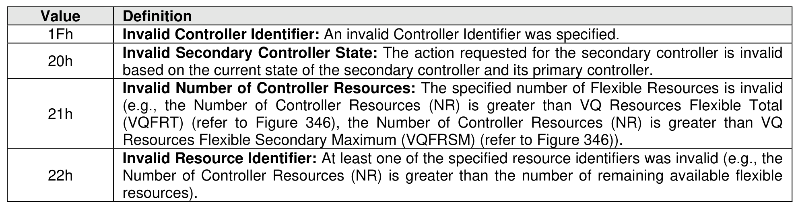
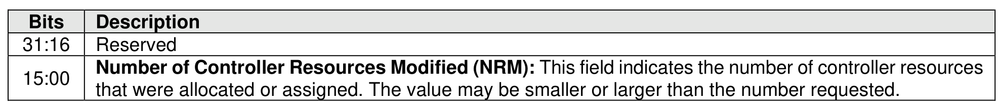

##### 5.3.6.1 Command Completion

> **Section ID**: 5.3.6.1 | **Page**: 487-488

Command specific status values associated with the Virtualization management command are defined in
Figure 520.
Dword 0 of the completion queue entry contains information about the controller resources that were
modified as part of the Primary Controller Flexible Allocation and Secondary Controller Assign actions.
Dword 0 of the completion queue entry is defined in Figure 521.

---
### 📊 Tables (2)

#### Table 1: Untitled Table

| | |
| :--- | :--- |
| | Invalid Secondary Controller State: The action requested for the secondary controller is invalid based on the current state of the secondary controller and its primary controller. |
| | Invalid Number of Controller Resources: The specified number of Flexible Resources is invalid (e.g., the Number of Controller Resources (NR) is greater than VQ Resources Flexible Total (VQFRT) (refer to Figure 346), the Number of Controller Resources (NR) is greater than VQ Resources Flexible Secondary Maximum (VQFRSM) (refer to Figure 346)). |
| | Invalid Resource Identifier: At least one of the specified resource identifiers was invalid (e.g., the Number of Controller Resources (NR) is greater than the number of remaining available flexible resources). |

#### Table 2: Untitled Table

(Continuation of Untitled Table - see first part)

