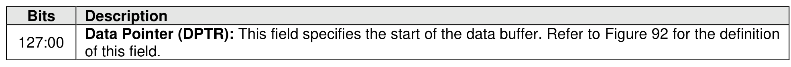
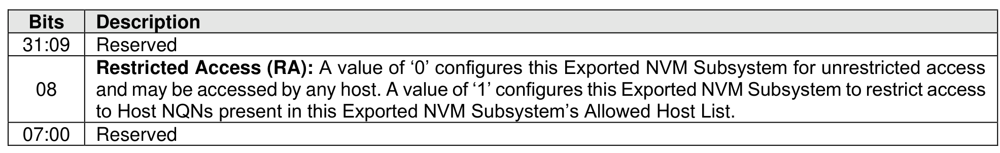

#### 5.4.2 Create Exported NVM Subsystem command

> **Section ID**: 5.4.2 | **Page**: 488-489

The Create Exported NVM Subsystem command is used to create a new Exported NVM Subsystem. The
Create Exported NVM Subsystem command uses the Data Pointer and Command Dword 10. All other
command specific fields are reserved.
The Create Exported NVM Subsystem command shall not be supported by Exported NVM Subsystems.
The Restricted Access bit defined in Figure 523 specifies the initial access setting for the Exported NVM
Subsystem.

---
### 📊 Tables (2)

#### Table 1: Untitled Table

| Description |  |
| :--- | :--- |
| and may be accessed by any host. A value of 1 configures this Exported NVM Subsystem to restrict access to Host NQNs present in this Exported NVM Subsystem's Allowed Host List. |  |
| Reserved |  |

#### Table 2: Untitled Table

(Continuation of Untitled Table - see first part)

