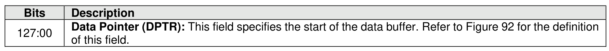
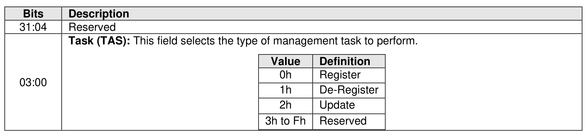
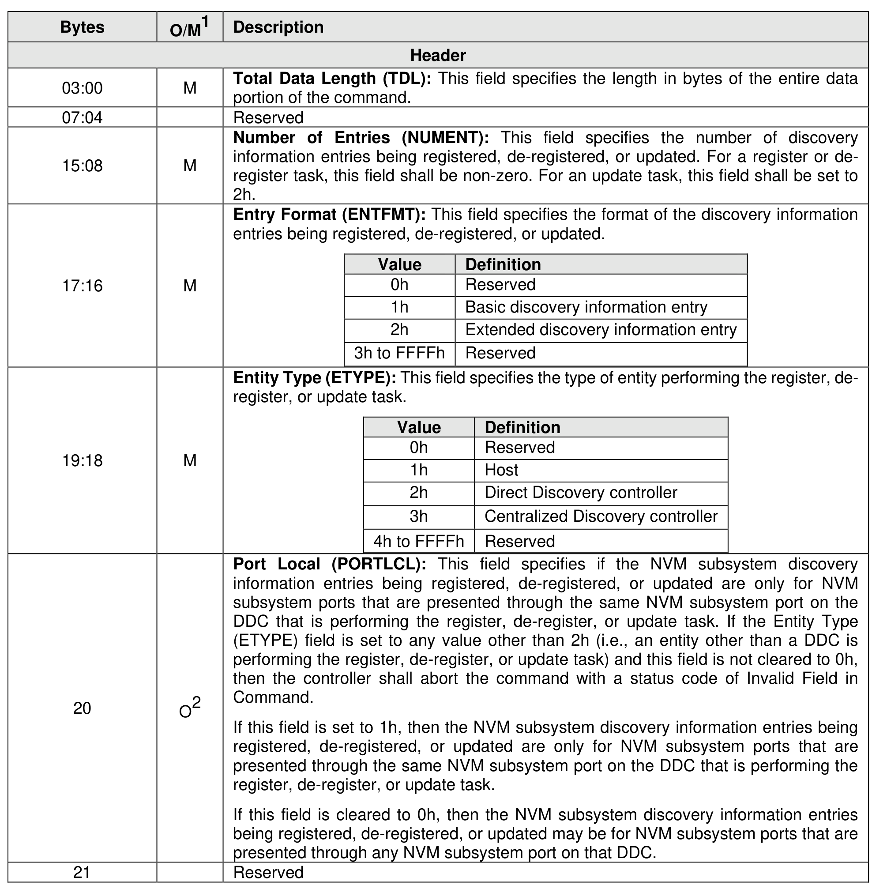
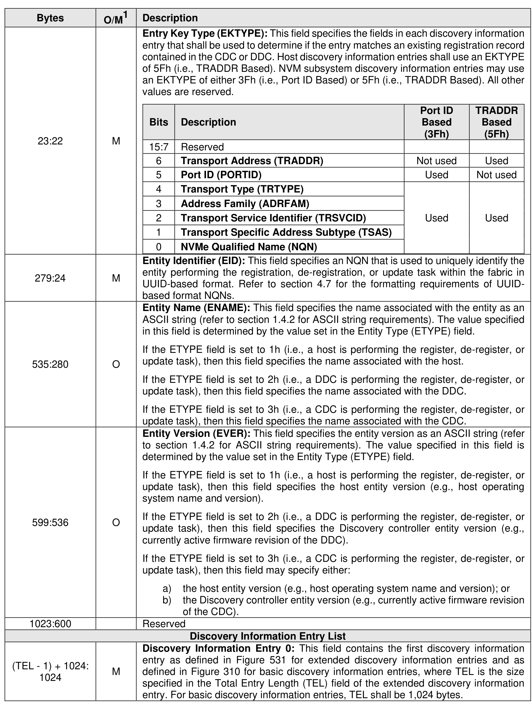
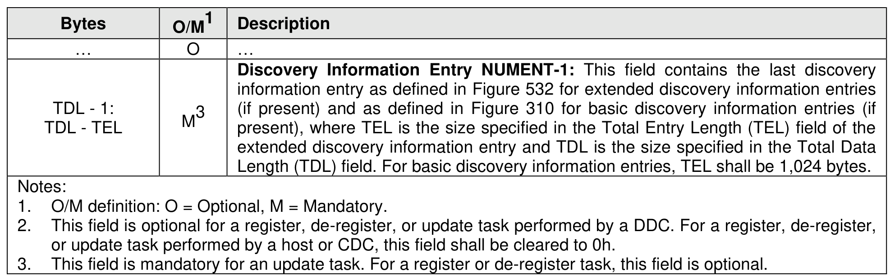
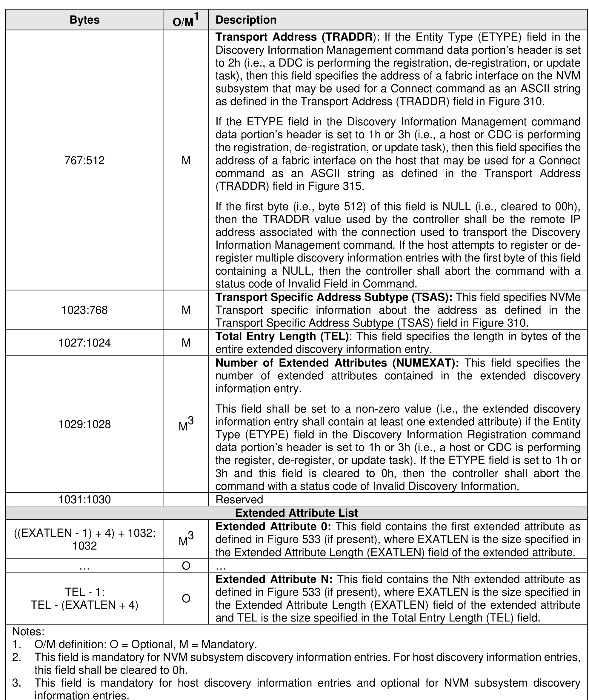
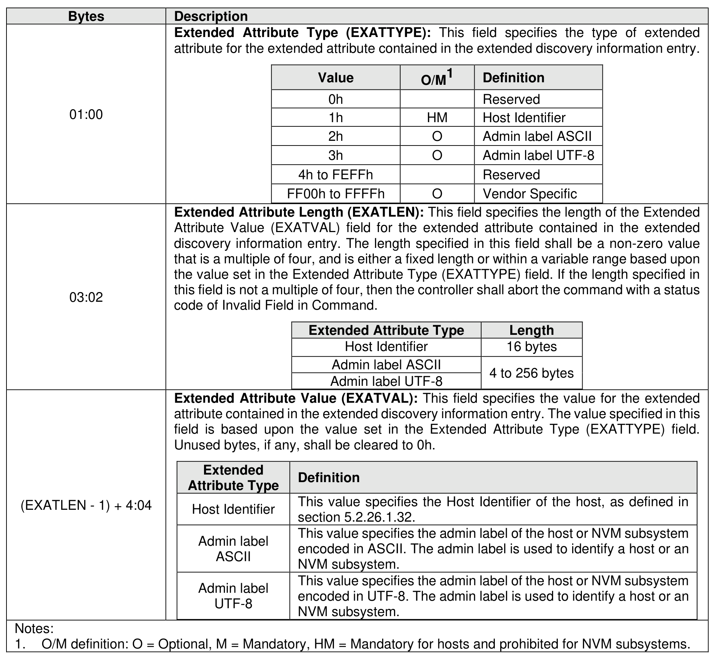
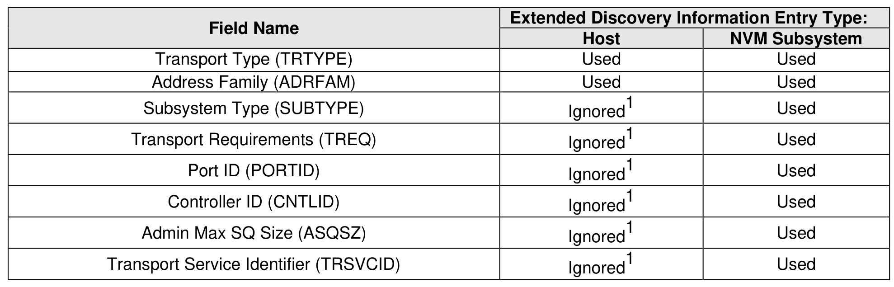
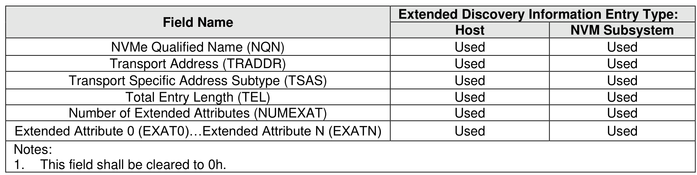

#### 5.4.4 Discovery Information Management command

> **Section ID**: 5.4.4 | **Page**: 492-499

The Discovery Information Management command registers, de-registers, or updates discovery information
entries.
The type of task performed by the Discovery Information Management command (i.e., registration, de-
registration, or update) is determined by the value set in Task (TAS) field of Command Dword 10 (refer to
Figure 530).
For a register task (i.e., TAS field cleared to 0h), the Discovery Information Management command
registers:
•
one or more host discovery information entries; or
•
one or more NVM subsystem discovery information entries.
For a de-register task (i.e., TAS field set to 1h), the Discovery Information Management command de-
registers:
•
one or more host discovery information entries; or
•
one or more NVM subsystem discovery information entries.
For an update task (i.e., TAS field set to 2h), the Discovery Information Management command updates:
•
one host discovery information entry; or
•
one NVM subsystem discovery information entry.
Discovery information entries may be one of the following:
•
a basic discovery information entry (refer to Figure 310); or
•
an extended discovery information entry (refer to Figure 532).
Host discovery information entries shall be extended discovery information entries.
NVM subsystem discovery information entries may be basic discovery information entries or may be
extended discovery information entries. Each NVM subsystem discovery information entry may specify an
NVM subsystem that exposes namespaces that hosts may access or may specify a referral to another
Discovery subsystem.
The Discovery Information Management command uses the Data Pointer field as shown in Figure 529 and
Command Dword 10 as shown in Figure 530. All other command specific fields are reserved.
The data portion of the Discovery Information Management command contains a header that identifies the
entity performing the register, de-register, or update task.
If a register task is being performed and the data portion of the Discovery Information Management
command does not contain one or more discovery information entries, then the controller shall abort the
command with status code of Invalid Field in Command. If the number of discovery information entries
contained in the data portion of the Discovery Information Management command exceeds the available
capacity for new discovery information entries on the CDC or DDC, then the controller shall abort the
command with a status code of Insufficient Discovery Resources. If multiple register tasks are performed
by the same entity (i.e., the value set in the Entity Identifier (EID) field of the header is associated with an
existing registration record contained in the CDC or DDC), and:
a) the Entry Key associated with a discovery information entry in the Discovery Information
Management command matches the Entry Key associated with an existing registration record, then
the existing registration record contained in the CDC or DDC shall be updated with the discovery
information entry from the Discovery Information Management command; or
b) the Entry Key associated with a discovery information entry in the Discovery Information
Management command does not match the Entry Key associated with an existing registration
record, then the discovery information entry in the Discovery Information Management command
shall be registered with the CDC or DDC.
If a de-register task is being performed and the data portion of the Discovery Information Management
command does not contain one or more discovery information entries, then the controller shall abort the
command with a status code of Invalid Field in Command.
If an update task is being performed and the data portion of the Discovery Information Management
command does not contain two discovery information entries, then the controller shall abort the command
with a status code of Invalid Field in Command. The first discovery information entry identifies the
registration record contained in the CDC or DDC that is to be updated. The fields in the first discovery
information entry that are not used as part of the Entry Key are ignored. The second discovery information
entry replaces the existing registration record identified by the Entry Key from the first discovery information
entry. The update task shall be atomic.
The format for the data portion of the Discovery Information Management command is defined in Figure
531.
Based upon the value set in the Entity Type (ETYPE) field of the header, the data portion of a Discovery
Information Management command shall:
•
only contain host extended discovery information entries if the ETYPE field is set to 1h (i.e., a host
is performing the register, de-register, or update task);
•
only contain host extended discovery information entries if the ETYPE field is set to 3h (i.e., a CDC
is performing the register, de-register, or update task); and
•
only contain NVM subsystem basic discovery information entries or NVM subsystem extended
discovery information entries if the ETYPE field is set to 2h (i.e., a DDC is performing the register,
de-register, or update task). The DDC may set the Port Local (PORTLCL) field to 1h if the NVM
subsystem discovery information entries being registered, de-registered, or updated are only for
NVM subsystem ports that are presented through the same NVM subsystem port on the DDC that
is performing the register, de-register, or update task.
Host extended discovery information entries and NVM subsystem extended discovery information entries
each contain the same set of fields, but not all of the fields are used for both extended discovery information
entry types. Refer to Figure 534 for the usage of the extended discovery information entry fields for each
extended discovery information entry type. If the entity performing a register, de-register, or update task
uses any field in an extended discovery information entry that conflicts with the value set in the ETYPE field
of the Discovery Information Management command data portion’s header (e.g., a host uses a field
intended for only NVM subsystem extended discovery information entries), then the controller shall abort
the command with a status code of Invalid Discovery Information.
Host extended discovery information entries shall contain at least one extended attribute containing a Host
Identifier. NVM subsystem extended discovery information entries may contain zero or more extended
attributes. The format for an extended attribute is defined in Figure 533.

---
### 📊 Tables (10)

#### Table 1: Untitled Table

| | | |
| :--- | :--- | :--- |
| | | 1h | De-Register |
| | | 2h | Update |
| | | 3h to Fh | Reserved |
| | | | |
| | | | |
| | | | |
| | | | |
| | | | |
| | | | |
| | | | | |
| :--- | :--- | :--- | :--- | :--- |
| | | | **Port ID Based (3Fh)** | **TRADDR Based (5Fh)** |
| | | **Bits** | **Description** | |
| | | 15:7 | Reserved | |
| | | 6 | Transport Address (TRADDR) | Not used | Used |
| | | 5 | Port ID (PORTID) | Used | Not used |
| | | 4 | Transport Type (TRTYPE) | | |
| | | 3 | Address Family (ADRFAM) | | |
| | | 2 | Transport Service Identifier (TRSVCID) | Used | Used |
| | | 1 | Transport Specific Address Subtype (TSAS) | | |
| | | 0 | NVMe Qualified Name (NQN) | | |
| | | | | |
| | | | | |
| | | | | |
| | | | | |
| | | |
| 02 | M² | Subsystem Type (SUBTYPE): This field specifies the type of the NVM subsystem that is indicated in this entry as defined in the Subsystem Type (SUBTYPE) field in Figure 310. |
| :--- | :--- | :--- |
| 03 | M² | Transport Requirements (TREQ): This field specifies requirements for the NVMe Transport as defined in the Transport Requirements (TREQ) field in Figure 310. |
| 05:04 | M² | Port ID (PORTID): This field specifies a particular NVM subsystem port as defined in the Port ID (PORTID) field in Figure 310. |
| 07:06 | M² | Controller ID (CNTLID): This field specifies the controller ID as defined in the Controller ID (CNTLID) field in Figure 310. This field shall specify a controller ID that a host is able to use in a Connect command to the NVM subsystem being registered. |
| 09:08 | M² | Admin Max SQ Size (ASQSZ): This field specifies the maximum size of an Admin Submission Queue as defined in the Admin Max SQ Size (ASQSZ) field in Figure 310. |
| 31:10 | | Reserved |
| 63:32 | M² | Transport Service Identifier (TRSVCID): This field specifies the NVMe Transport service identifier as an ASCII string as defined in the Transport Service Identifier (TRSVCID) field in Figure 310. |
| 255:64 | | Reserved |
| 511:256 | M | NVMe Qualified Name (NQN): If the Entity Type (ETYPE) field in the Discovery Information Management command data portion's header is set to 2h (i.e., a DDC is performing the register, de-register, or update task), then this field specifies the NVMe Qualified Name (NQN) that uniquely identifies the NVM subsystem as defined in the NVM Subsystem Qualified Name (SUBNQN) field in Figure 310.   If the ETYPE field in the Discovery Information Management command data portion's header is set to 1h or 3h (i.e., a host or CDC is performing the register, de-register, or update task), then this field specifies the NQN that uniquely identifies the host as defined in the Host NVMe Qualified Name (HOSTNQN) field in Figure 315. |
| | | |
| :--- | :--- | :--- |
| 767:512 | M | Transport Address (TRADDR): If the Entity Type (ETYPE) field in the Discovery Information Management command data portion's header is set to 2h (i.e., a DDC is performing the registration, de-registration, or update task), then this field specifies the address of a fabric interface on the NVM subsystem that may be used for a Connect command as an ASCII string as defined in the Transport Address (TRADDR) field in Figure 310.  If the ETYPE field in the Discovery Information Management command data portion's header is set to 1h or 3h (i.e., a host or CDC is performing the registration, de-registration, or update task), then this field specifies the address of a fabric interface on the host that may be used for a Connect command as an ASCII string as defined in the Transport Address (TRADDR) field in Figure 315.  If the first byte (i.e., byte 512) of this field is NULL (i.e., cleared to 00h), then the TRADDR value used by the controller shall be the remote IP address associated with the connection used to transport the Discovery Information Management command. If the host attempts to register or de-register multiple discovery information entries with the first byte of this field containing a NULL, then the controller shall abort the command with a status code of Invalid Field in Command. |
| 1023:768 | M | Transport Specific Address Subtype (TSAS): This field specifies NVMe Transport specific information about the address as defined in the Transport Specific Address Subtype (TSAS) field in Figure 310. |
| 1027:1024 | M | Total Entry Length (TEL): This field specifies the length in bytes of the entire extended discovery information entry. |
| 1029:1028 | M³ | Number of Extended Attributes (NUMEXAT): This field specifies the number of extended attributes contained in the extended discovery information entry.  This field shall be set to a non-zero value (i.e., the extended discovery information entry shall contain at least one extended attribute) if the Entity Type (ETYPE) field in the Discovery Information Registration command data portion's header is set to 1h or 3h (i.e., a host or CDC is performing the register, de-register, or update task). If the ETYPE field is set to 1h or 3h and this field is cleared to 0h, then the controller shall abort the command with a status code of Invalid Discovery Information. |
| 1031:1030 | | Reserved |
| | | **Extended Attribute List** |
| LEN - 1) + 4) + 1032: 1032 | M³ | **Extended Attribute 0**: This field contains the first extended attribute as defined in Figure 533 (if present), where EXATLEN is the size specified in the Extended Attribute Length (EXATLEN) field of the extended attribute. |
| ... | O | ... |
| TEL - 1: - (EXATLEN + 4) | O | **Extended Attribute N**: This field contains the Nth extended attribute as defined in Figure 533 (if present), where EXATLEN is the size specified in the Extended Attribute Length (EXATLEN) field of the extended attribute and TEL is the size specified in the Total Entry Length (TEL) field. |
| | | M definition: O = Optional, M = Mandatory. This field is mandatory for NVM subsystem discovery information entries. For host discovery information entries, this field shall be cleared to 0h. This field is mandatory for host discovery information entries and optional for NVM subsystem discovery information entries. |
| Field Name | Extended Discovery Information Entry Type: |  |
| :--- | :--- | :--- |
| | Host | NVM Subsystem |
| Transport Type (TRTYPE) | Used | Used |
| Address Family (ADRFAM) | Used | Used |
| Subsystem Type (SUBTYPE) | Ignored¹ | Used |
| Transport Requirements (TREQ) | Ignored¹ | Used |
| Port ID (PORTID) | Ignored¹ | Used |
| Controller ID (CNTLID) | Ignored¹ | Used |
| NVMe Qualified Name (NQN) | Used | Used |
| Transport Address (TRADDR) | Used | Used |
| Transport Specific Address Subtype (TSAS) | Used | Used |
| Total Entry Length (TEL) | Used | Used |
| Number of Extended Attributes (NUMEXAT) | Used | Used |
| Extended Attribute 0 (EXAT0)...Extended Attribute N (EXATN) | Used | Used |

#### Table 2: Untitled Table

(Continuation of Untitled Table - see first part)

#### Table 3: Untitled Table

(Continuation of Untitled Table - see first part)

#### Table 4: Untitled Table

(Continuation of Untitled Table - see first part)

#### Table 5: Untitled Table

(Continuation of Untitled Table - see first part)

#### Table 6: Untitled Table

(Continuation of Untitled Table - see first part)

#### Table 7: Untitled Table

(Continuation of Untitled Table - see first part)

#### Table 8: Untitled Table

(Continuation of Untitled Table - see first part)

#### Table 9: Untitled Table

(Continuation of Untitled Table - see first part)

#### Table 10: Untitled Table

(Continuation of Untitled Table - see first part)

