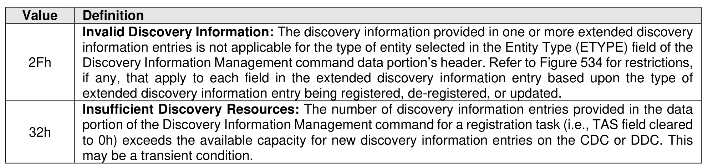

##### 5.4.4.1 Command Completion

> **Section ID**: 5.4.4.1 | **Page**: 499-499

Upon completion of the Discovery Information Management command, the controller posts a completion
queue entry to the Admin Completion Queue indicating the status of the command. Discovery Information
Management command specific status values are defined in Figure 535.

---
### 📊 Tables (1)

#### Table 1: Untitled Table

| Description |  |
| :--- | :--- |
| Data Pointer (DPTR): This field specifies the start of the data buffer. Refer to Figure 92 for the definition of this field. |  |

