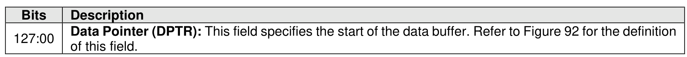
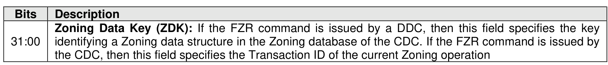
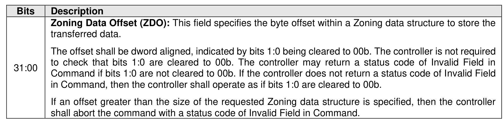
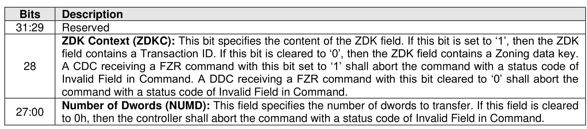

#### 5.4.6 Fabric Zoning Receive command

> **Section ID**: 5.4.6 | **Page**: 500-500

The Fabric Zoning Receive (FZR) command is used to receive a Zoning data structure. The FZR command
uses the Data Pointer, Command Dword 10, Command Dword 11, and Command Dword 12 fields, as
shown in Figure 539, Figure 540, Figure 541, and Figure 542 respectively.

---
### 📊 Tables (4)

#### Table 1: Untitled Table

| Description |  |
| :--- | :--- |
| Reserved |  |
| ZDK Context (ZDKC): This bit specifies the content of the ZDK field. If this bit is set to '1', then the ZDK field contains a Transaction ID. If this bit is cleared to '0', then the ZDK field contains a Zoning data key. A CDC receiving a FZR command with this bit set to '1' shall abort the command with a status code of Invalid Field in Command. A DDC receiving a FZR command with this bit cleared to '0' shall abort the command with a status code of Invalid Field in Command. |  |
| Number of Dwords (NUMD): This field specifies the number of dwords to transfer. If this field is cleared to 0h, then the controller shall abort the command with a status code of Invalid Field in Command. |  |

#### Table 2: Untitled Table

(Continuation of Untitled Table - see first part)

#### Table 3: Untitled Table

(Continuation of Untitled Table - see first part)

#### Table 4: Untitled Table

(Continuation of Untitled Table - see first part)

