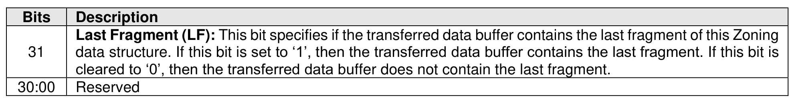

##### 5.4.6.1 Command Completion

> **Section ID**: 5.4.6.1 | **Page**: 500-501

Upon completion of the Fabric Zoning Receive (FZR) command, the controller posts a completion queue
entry to the Admin Completion Queue indicating the status of the command. Command specific status
values for the FZR command are defined in Figure 543.
The last fragment indication is returned in Dword 0 of the completion queue entry, as defined in Figure 544.

---
### 📊 Tables (2)

#### Table 1: Untitled Table

| Zoning Data Structure Not Found: The requested Zoning data structure does not exist on the CDC. |  |
|---|---|
| Requested Function Disabled: Fabric Zoning is not enabled on the CDC. |  |
| ZoneGroup Originator Invalid: The DDC is not allowed to access the specified ZoneGroup. |  |

#### Table 2: Untitled Table

(Continuation of Untitled Table - see first part)

