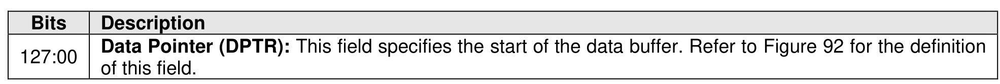
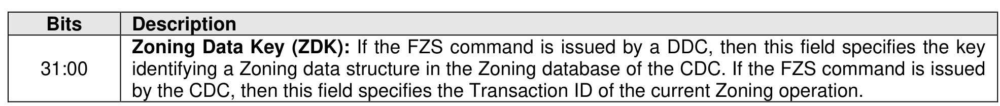
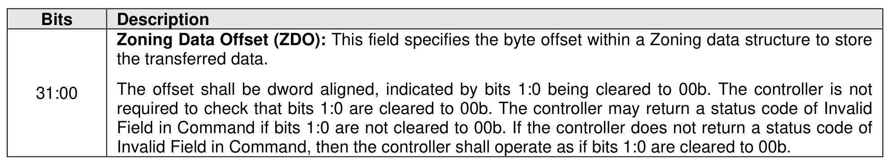
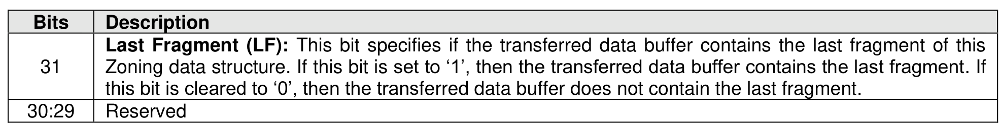
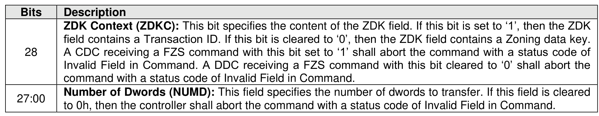

#### 5.4.7 Fabric Zoning Send command

> **Section ID**: 5.4.7 | **Page**: 501-502

The Fabric Zoning Send (FZS) command is used to send a Zoning data structure. The FZS command uses
the Data Pointer, Command Dword 10, Command Dword 11, and Command Dword 12 fields, as shown in
Figure 545, Figure 546, Figure 547, and Figure 548 respectively.

---
### 📊 Tables (5)

#### Table 1: Untitled Table

| Description |  |
| :--- | :--- |
| Last Fragment (LF): | This bit specifies if the transferred data buffer contains the last fragment of this Zoning data structure. If this bit is set to '1', then the transferred data buffer contains the last fragment. If this bit is cleared to '0', then the transferred data buffer does not contain the last fragment. |
| Reserved |  |
| | field contains a Transaction ID. If this bit is cleared to '0', then the ZDK field contains a Zoning data key. A CDC receiving a FZS command with this bit set to '1' shall abort the command with a status code of Invalid Field in Command. A DDC receiving a FZS command with this bit cleared to '0' shall abort the command with a status code of Invalid Field in Command. |
| Number of Dwords (NUMD): | This field specifies the number of dwords to transfer. If this field is cleared to 0h, then the controller shall abort the command with a status code of Invalid Field in Command. |

#### Table 2: Untitled Table

(Continuation of Untitled Table - see first part)

#### Table 3: Untitled Table

(Continuation of Untitled Table - see first part)

#### Table 4: Untitled Table

(Continuation of Untitled Table - see first part)

#### Table 5: Untitled Table

(Continuation of Untitled Table - see first part)

