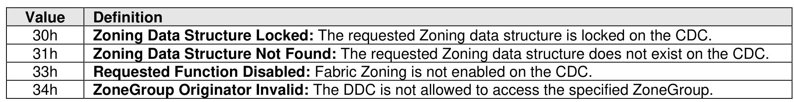

##### 5.4.7.1 Command Completion

> **Section ID**: 5.4.7.1 | **Page**: 502-502

Upon completion of the Fabric Zoning Send (FZS) command, the controller posts a completion queue entry
to the Admin Completion Queue indicating the status of the command. Command specific status values for
the FZS command are defined in Figure 549.

---
### 📊 Tables (1)

#### Table 1: Untitled Table

| Field | Description |
| :--- | :--- |
| **Select** | This field determines which management operation is to be performed in this command. The specified management operation determines the data structure used as part of the command. |
| **Data Pointer** | This field is used to point to the data structure used as part of the command. The data structure is defined by the management operation specified in the Select field. |
| **Dword 10** | This field is used to specify the management operation. The value of this field determines the operation to be performed. |
| **Other fields** | All other command-specific fields are reserved. |

