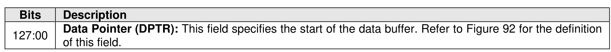
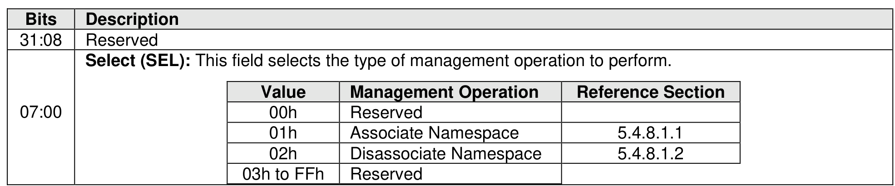

#### 5.4.8 Manage Exported Namespace command

> **Section ID**: 5.4.8 | **Page**: 502-502

The Manage Exported Namespace command is used to manage associations of Exported Namespaces
with Exported NVM Subsystems. The Manage Exported Namespace command uses the Data Pointer and
Command Dword 10. All other command specific fields are reserved.
The Select field defined in Figure 551determines which management operation is to be performed in this
command. The specified management operation determines the data structure used as part of the
command. The data structure is 4,096 bytes in size (refer to subsections below for description of operation
specific data structures).
The Manage Exported Namespace command shall not be supported by Exported NVM Subsystems.

---
### 📊 Tables (2)

#### Table 1: Untitled Table

| 00h | Reserved |
|:---|:---|
| 01h | Associate Namespace | 5.4.8.1.1 |
| 02h | Disassociate Namespace | 5.4.8.1.2 |
| 03h to FFh | Reserved |

#### Table 2: Untitled Table

(Continuation of Untitled Table - see first part)

