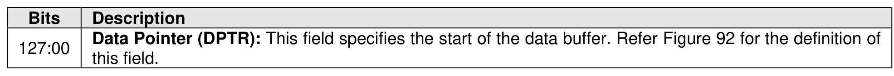
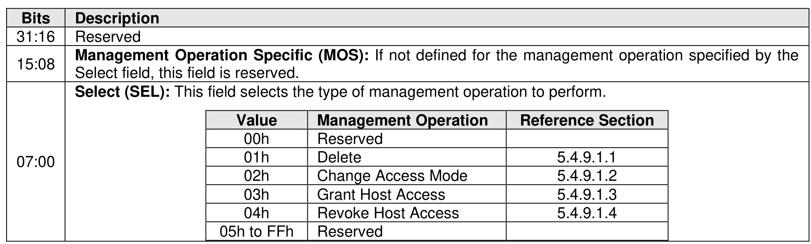

#### 5.4.9 Manage Exported NVM Subsystem command

> **Section ID**: 5.4.9 | **Page**: 504-505

The Manage Exported NVM Subsystem command is used to configure and manage an Exported NVM
Subsystem.
The Manage Exported NVM Subsystem command uses the Data Pointer and Command Dword 10. All
other command specific fields are reserved.
The Select field defined in Figure 555 determines which management operation is to be performed by this
command. The specified management operation determines the data structure used as part of the
command. The data structure is 4,096 bytes in size. Refer to section 5.4.9.1 for a description of each
management operation.
The Manage Exported NVM Subsystem command shall not be supported by Exported NVM Subsystems

---
### 📊 Tables (2)

#### Table 1: Untitled Table

| Value | Management Operation | Reference Section |
| :--- | :--- | :--- |
| 00h | Reserved | |
| 01h | Delete | 5.4.9.1.1 |
| 02h | Change Access Mode | 5.4.9.1.2 |
| 03h | Grant Host Access | 5.4.9.1.3 |
| 04h | Revoke Host Access | 5.4.9.1.4 |
| 05h to FFh | Reserved | |

#### Table 2: Untitled Table

(Continuation of Untitled Table - see first part)

