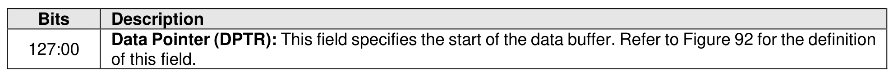
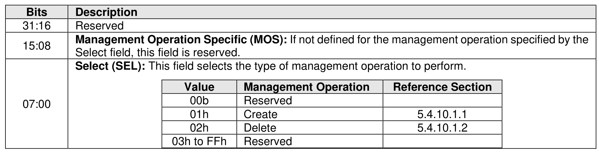

#### 5.4.10 Manage Exported Port command

> **Section ID**: 5.4.10 | **Page**: 508-509

The Manage Exported Port command is used to manage associations of Exported Ports with Exported
NVM Subsystems. The Manage Exported Port command uses the Data Pointer and Command Dword 10.
All other command specific fields are reserved.
The Select field defined in Figure 562 determines which management operation is to be performed in this
command. The specified management operation determines the data structure used as part of the
command. The data structure is 4,096 bytes in size.
The Manage Exported Port command shall not be supported by Exported NVM Subsystems.

---
### 📊 Tables (2)

#### Table 1: Untitled Table

| Value | Management Operation | Reference Section |
| :--- | :--- | :--- |
| 00b | Reserved | |
| 01h | Create | 5.4.10.1.1 |
| 02h | Delete | 5.4.10.1.2 |
| 03h to FFh | Reserved | |

#### Table 2: Untitled Table

(Continuation of Untitled Table - see first part)

