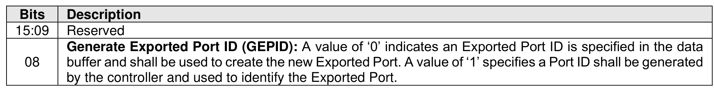
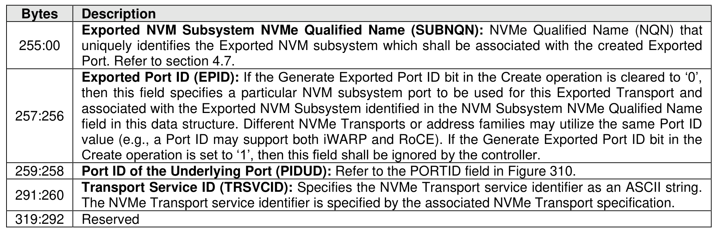
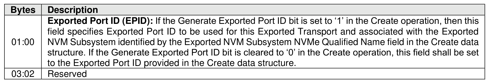

###### 5.4.10.1.1 Create (Management Operation 01h)

> **Section ID**: 5.4.10.1.1 | **Page**: 509-510

The Create operation of the Manage Exported Port command is used to create an Exported Port in an
Exported NVM Subsystem and associate the Exported Port with an Underlying Port in the Ports List. The
resulting association enables the specified Exported NVM Subsystem to be accessed by hosts through the
specified Exported Port. The Exported Port ID for the Exported Port that is created may be specified by the
host or generated by the controller.
The data pointer shall point to an Create data structure (refer to Figure 564).
Upon successful completion of a Manage Exported Port command with a Create operation, Dword 0 of the
completion queue entry of the Manage Exported Port command contains the Exported Port ID associated
with the Exported NVM Subsystem (refer to Figure 565).
If the Exported NVM Subsystem NVMe Qualified Name field specified in the Create Data Structure does
not identify an existing Exported NVM Subsystem, then the controller shall abort the command with a status
code of Invalid Field in Command.
If the Generate Exported Port ID bit is cleared to ‘0’ in the Create data structure indicating an Exported Port
ID is specified in the Manage Exported Port data structure and used to identify the new Exported Port; and:
•
an Exported Port ID is not specified in the Manage Exported Port data structure in the data buffer;
or
•
an Exported Port ID specified in the data buffer does not uniquely identify an Exported NVM
Subsystem Port (i.e., if the specified Exported Port ID is used to identify an already existing
Exported NVM Subsystem Port),
then the controller shall abort the command with a status code of Invalid Field in Command.

---
### 📊 Tables (3)

#### Table 1: Untitled Table

| Description |
| :--- |
| Exported NVM Subsystem NVMe Qualified Name (SUBNQN): NVMe Qualified Name (NQN) that uniquely identifies the Exported NVM subsystem which shall be associated with the created Exported Port. Refer to section 4.7. |
| Exported Port ID (EPID): If the Generate Exported Port ID bit in the Create operation is cleared to '0', then this field specifies a particular NVM subsystem port to be used for this Exported Transport and associated with the Exported NVM Subsystem identified in the NVM Subsystem NVMe Qualified Name field in this data structure. Different NVMe Transports or address families may utilize the same Port ID. |
| Transport Service ID (TRSVCID): Specifies the NVMe Transport service identifier as an ASCII string. The NVMe Transport service identifier is specified by the associated NVMe Transport specification. |
| Reserved |
| Successful completion of a Manage Exported Port command with a Create operation, Dword 0 of the command queue entry of the Manage Exported Port command contains the Exported Port ID associated with the Exported NVM Subsystem (refer to Figure 565). |
| field specifies Exported Port ID to be used for this Exported Transport and associated with the Exported NVM Subsystem identified by the Exported NVM Subsystem NVMe Qualified Name field in the Create data structure. If the Generate Exported Port ID bit is cleared to '0' in the Create operation, this field shall be set to the Exported Port ID provided in the Create data structure. |
| Reserved |
| If the Exported NVM Subsystem NVMe Qualified Name field specified in the Create Data Structure does not identify an existing Exported NVM Subsystem, then the controller shall abort the command with a status of Invalid Field in Command. |

#### Table 2: Untitled Table

(Continuation of Untitled Table - see first part)

#### Table 3: Untitled Table

(Continuation of Untitled Table - see first part)

